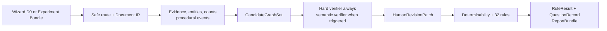

# N-Truth

[](https://github.com/Massimilianociconte/N-truth/actions/workflows/ci.yml)
[](https://www.python.org/)
[](LICENSE)
[](docs/system-card-v0.1.md)

N-Truth is a **local-first, human-in-the-loop, neuro-symbolic** research project for
reconstructing biological experimental designs as a typed graph and applying
inspectable **deterministic** rules. The intended pipeline is:

```text
documents → AI candidate facts only → (human review) → Experiment Graph
        → rules engine → conditional derivations + rule/premise traces
```

Given a supported input and a validated or human-confirmed graph, the software
**can** compute software-normative experimental-unit assessments, dependence
structure, conditional `n` branches, missing-information signals and decisive
questions **for human review**. Scientific correctness is **not** validated.

The current specification is **PRD v7.0** (v6.1 is historical). Release work is
organised as **Workstream A** (scientific foundation), **Workstream B** (Minimum
Viable Train A contracts), **Workstream C** (real-anchor / silver / synthetic under
gate), and **Workstream D** (governance/adoption). Historical reports may still use
pre-v7 workstream labels. The AI model is **not** authorized to emit final
independent `n`, scientific verdicts, pseudoreplication product verdicts, definitive
statistical tests, free-form `RuleResult`s, or final `DeterminabilityState`.

> N-Truth is research software in **alpha** status. It does **not** certify statistical
> validity, reproducibility, research integrity, privacy compliance or adherence to
> DRIVER/NC3Rs. It does not replace a biostatistician or domain expert. It is
> **experimental and not intended for scientific decision-making** without human
> review. **Reality Gate (clean checkout):** engineering readiness is
> **component-reported**; **data readiness is `BLOCKED`**; scientific validation is
> **`NOT_STARTED`**. Substantive training is **`HOLD_PENDING_REAL_ANCHOR`**.
> ModernBERT training and Granite promotion remain **HOLD**. No gold corpus, no
> scientifically trained N-Truth model, and no externally validated performance claim
> exist. Claims about local Granite fingerprints or `models/registry/*` apply only when
> those artefacts are present; they are **not** part of a bare clean checkout.

Repository: [github.com/Massimilianociconte/N-truth](https://github.com/Massimilianociconte/N-truth)<br>
Issues: [bug reports and feature requests](https://github.com/Massimilianociconte/N-truth/issues)<br>
Security: [private reporting policy](SECURITY.md)

## What N-Truth does

- officially supports a D0 path with the prospective wizard, TXT/Markdown and simple
  CSV; complex documents and statistical code require explicit
  `extended_experimental` opt-in;
- never executes imported statistical code;
- segments multiple experimental blocks instead of assigning one label to a paper;
- keeps allocation level, application level and observation level distinct;
- represents factors, contrasts, endpoints, targets, estimands, pairing, blocking,
  pooling, nesting, repeated measures and declared clustering;
- distinguishes planned, allocated, treated, observed, excluded, analysed, declared,
  observational, analytical, biological-source, independent and diagnostic effective
  counts, including quantifier and scope;
- implements PRD v7 `DeterminabilityStateV7` (eight normative states) additively
  beside the legacy four-state v3 enum, with permitted/forbidden outputs per state;
- generates and validates a canonical SampleSheetSpec without inferring independence
  from IDs or factor columns;
- abstains or emits explicit scenarios when a decisive fact is unknown;
- separates design replication, analytical dependence and inference scope;
- supports evidence-linked human corrections, append-only revisions, undo/redo and
  candidate-annotation export;
- exports JSON, YAML, HTML, graph JSON, JSON-LD/RO-Crate and machine-readable schemas;
- scans locally for privacy indicators and denies sharing/redistribution by default.

It does **not** perform OCR, choose a definitive statistical test, upload files or grant
rights to use third-party data. The optional MLX lane can prepare governed data,
fine-tune and evaluate a local candidate-fact parser; it is not invoked by the default
CLI/API/UI and remains blocked for scientific training until the human/data gates are
satisfied.

## Scientific model

Every rule answers exactly one of three questions:

| Class | Meaning |
|---|---|
| `DESIGN_REPLICATION` | Is the factor replicated across independently allocable units? |
| `ANALYTICAL_DEPENDENCE` | Does the analysis represent correlation between observations? |
| `INFERENCE_SCOPE` | Does the claim stay within the population and hierarchy actually replicated? |

An experimental unit is always relative to a factor and contrast. `allocation_level`
is necessary but insufficient: `independently_assigned` is a required
`TRUE`/`FALSE`/`UNKNOWN` fact and `TRUE` requires an explicit mechanism. A hierarchical
model can represent dependence but cannot create missing biological replication.
Author phrases such as “independent experiments”, distinct IDs or well-level rows do
not establish independence by themselves. When independence is unknown,
`n_independent` remains `null` or appears only inside explicit conditional branches.

PRD v7 defines eight normative states: `DETERMINATE`,
`CONDITIONALLY_DETERMINATE`, `MULTIPLE_PLAUSIBLE_GRAPHS`, `INSUFFICIENT_INFORMATION`,
`CONFLICTING_INFORMATION`, `INVALID_GRAPH` and `OUT_OF_SCOPE` (plus the full App. M
output policy). Only `DETERMINATE` permits one unconditional experimental unit and
independent `n`. The legacy v3 enum in `schemas/core.py` still exposes four states for
backward-compatible reports; migration maps `INDETERMINATE` →
`INSUFFICIENT_INFORMATION`.

The public normative contract is [N-Truth Public Specification v0.1](docs/public-specification-v0.1.md).
The scientific sources cited by the 32 rules are resolvable in the
[versioned reference registry](docs/scientific-references.md). Rules and their current
10/17/5 class mapping remain candidates pending external wet-lab and biostatistical
review.

## Current status

Human summary for the **clean checkout**: [`docs/status-snapshot.md`](docs/status-snapshot.md).
PRD v7 alignment audits: [`docs/audits/prd-v7-root-alignment/`](docs/audits/prd-v7-root-alignment/).
Machine-readable Reality Gate: `ntruth quick-design reality-gate` (fail-closed; not a
scientific claim).

| Gate | Clean-checkout value |
|---|---|
| PRD specification | **v7.0 current** (v6.1 historical) |
| `engineering_readiness` | `PARTIAL_OR_VERIFIED_BY_COMPONENT` |
| `data_readiness` | **`BLOCKED`** |
| `scientific_validation_status` | **`NOT_STARTED`** |
| `training_execution_gate` | **`HOLD_PENDING_REAL_ANCHOR`** |
| ModernBERT / Granite promotion | **HOLD** |
| Real-data anchor | **not present in clean checkout** |
| Gold N-Truth corpus | **none** |

> Paths such as `models/registry/*` are **not** guaranteed in a clean checkout. Do not
> treat Appendix AA, dirty worktrees, or FLASH128-only trees as repository contents.

| Area | Implemented / engineering-tested | Still required for science |
|---|---|---|
| Deterministic core | Core Profile contracts, v7 determinability policy (additive to v3), hard verifier, 32 rules, lifecycle counts, conditional output, rule/premise traces | External wet-lab/biostat review; Derivation Gold on real cases |
| Prospective D0 | Cell-culture/well-plate 1-factor × 2-level × 1-endpoint wizard, SampleSheetSpec, API compilation | Durable multi-session persistence, accessibility review, real designs |
| Human workflow | Evidence view, constrained editors, validated patches, append-only audit, undo/redo | Formal adjudication on real data; visual span locator |
| Interfaces | CLI, loopback FastAPI, React UI (experimental graph canvas gated) | Auth / multi-user intentionally absent |
| Parser AI contracts | Stage envelopes, candidate-only `CandidateGraphSet`, schema validation | Full semantic baselines on real gold; model must not emit verdicts |
| Constrained decoding | Outlines + MLX stage schemas (form guarantee, not scientific truth) | Semantic adequacy remains insufficient on B4 DEV |
| B4 development eval | 39 frozen DEV cases; condition C mean primary F1 ≈ 0.17 | Independent real gold test; external challenge |
| Training tooling | MLX QLoRA pipeline; engineering smoke only | Real anchor ~30–50 double-reviewed blocks; frozen train/dev/test; hybrid LoRA |
| Annotation pilot | Dry-runs + first public-source trial; human second packet ready | Human second freeze; human–human comparison; formal 10–20 then calibration |

The repository contains 12 synthetic scientific regressions and 128 executable rule
scenarios (positive, negative, ambiguous and exception for each rule). These verify
**software contracts**; they are not an adjudicated scientific corpus.

## Architecture



The rules engine reads a validated, explicitly conditional or clearly marked candidate
graph, never raw prose. Candidate parser facts are untrusted until schema, reference,
coordinate, evidence and hard-invariant validation succeeds. Every stage returns a
versioned `complete`/`partial`/`failed` envelope; parser stages cannot emit a verdict.
The D0 compile action in the UI calls the canonical Python API and hard verifier. Live
pre-compile checks and the detailed proof presentation remain explicitly labelled client
previews; they cannot silently replace an unavailable API. CLI and API use the shared
application services. See
[architecture and invariants](docs/architettura.md) and the
[repository map](docs/repository-structure.md).

## Requirements

### Core

- macOS (Apple Silicon) or Linux x86-64;
- Python 3.12 or newer;
- [`uv`](https://docs.astral.sh/uv/) with the committed `uv.lock`.

### API/UI and development

- Node.js 20.19 or newer;
- pnpm 11.9.0, as declared in `apps/desktop/package.json`.

### Optional local ML lane

- macOS on Apple Silicon;
- 24 GiB unified memory is the target machine for the committed smoke profile;
- the current bootstrap guardrails require 52.2 GiB free for the model-only download
  gate and 85.5 GiB before the historical 35.5 GiB workspace allocation; these are
  planning values, not the normative v6.1 runtime budget;
- [`mlx-lm`](https://github.com/ml-explore/mlx-lm) 0.31.3, installed by the locked
  `ml` extra.

Model, backend, quantization, context and memory limits remain open ADR decisions.
Training or release claims require a measured `LOW_MEMORY`, `BALANCED` or `QUALITY`
profile from the [Runtime Resource Budget](docs/runtime-resource-budget-v6.1.md).

No database, cloud account, API key or GPU is required for the deterministic baseline.
The ML extra is intentionally unavailable on non-Apple platforms; the deterministic
core and CI remain portable. There is no PyPI release yet; install from this checkout
or from a verified local wheel.

## Installation

Clone the official repository and enter it:

```bash
git clone https://github.com/Massimilianociconte/N-truth.git
cd N-truth
```

Install only the deterministic core:

```bash
uv sync --locked
```

Add the local API:

```bash
uv sync --extra api --locked
```

Set up a contributor environment:

```bash
uv sync --extra dev --extra api --locked
pnpm --dir apps/desktop install --frozen-lockfile
```

On an Apple Silicon Mac, add the optional MLX lane:

```bash
uv sync --extra dev --extra api --extra ml --locked
uv run ntruth-ml check
```

`check` exits with code 2 until the pinned base snapshot is present. Downloading is a
separate, explicit and license-acknowledged operation:

```bash
uv run ntruth-ml download-model --confirm-license-and-download
uv run ntruth-ml verify-model
```

The provisional primary Train A model is **IBM Granite 4.1 3B Instruct**
([`ibm-granite/granite-4.1-3b`](https://huggingface.co/ibm-granite/granite-4.1-3b),
Apache-2.0). Registry status (machine-readable, **artifact-bound**; verify in
`models/registry/default.json`):

- `migration_status=ARCHITECTURE_MIGRATED`
- `runtime_qualification_status=PARTIALLY_VERIFIED` for the registered MLX community
  4-bit fingerprint only (not multipiattaforma `VERIFIED`)
- `scientific_validation_status=NOT_STARTED`

On Apple Silicon the MLX bootstrap uses a **community conversion** (not an
official IBM artifact):
[`mlx-community/granite-4.1-3b-4bit`](https://huggingface.co/mlx-community/granite-4.1-3b-4bit)
(revision `b1b476b5a17c46b7d6cd663b4a8ed44b66720aef`). Configured maximum context
is 131072 tokens; practical windows depend on host/backend and hierarchical
chunking. Weights live under `models/local/` (gitignored). Granite is **not**
scientifically selected. Structured decoding stabilizes **stage-level form**, not
scientific truth. Substantive LoRA remains
`HOLD_PENDING_REAL_ANCHOR`. See
[status snapshot](docs/status-snapshot.md),
[migration report](docs/granite-migration-report.md),
[ADR-0010](docs/adr/0010-granite-4.1-3b-migration.md).

`uv.lock` is authoritative. Do not replace a locked command with an unconstrained
`pip install` when reproducing a result or release gate.

## 60-second CLI quickstart

Inspect the software and bundled rules:

```bash
uv run ntruth version
uv run ntruth rules list
uv run ntruth rules show MIC-004
```

Create the D0 sample sheet before a prospective experiment:

```bash
uv run ntruth sample-sheet init ./samples.csv --factor treatment
uv run ntruth sample-sheet validate ./samples.csv
```

The template includes explicit provenance, containment, factor, endpoint and lifecycle
columns. IDs and factor levels are not accepted as evidence of allocation or
independence.

Analyze a public synthetic fixture:

```bash
uv run ntruth analyze \
  tests/scientific_fixtures/uc02_preparations/methods.md \
  --out ./ntruth-out \
  --lang it \
  --domain quantitative_microscopy \
  --acknowledge-unvalidated-domain
```

The acknowledgement confirms only that the domain warning was read. It does not
validate the domain or accept a scientific conclusion.

For a directory input, keep `--out` and any explicit `--project` outside the source
tree. The application rejects nested output/workspace paths before creating a run so
that historical source copies cannot contaminate a later analysis.

Each run receives an isolated directory:

```text
ntruth-out/runs/<run-id>/
├── project/                 # manifest + copied sources + local content storage
│   ├── ntruth.sqlite3
│   └── blobs/sha256/
└── revisions/0000/
    ├── report.json
    ├── report.yaml
    ├── report.html
    ├── graph.json
    ├── design-specification.json
    ├── design-compilation.json
    ├── parser-ai-input.schema.json
    ├── document-route.schema.json
    ├── evidence-extraction.schema.json
    ├── entity-count.schema.json
    ├── procedural-event.schema.json
    ├── candidate-graph-set.schema.json
    ├── verifier.schema.json
    ├── human-revision-patch.schema.json
    ├── rule-result.schema.json
    ├── question-record.schema.json
    ├── report-bundle.schema.json
    ├── parser-ai-output-legacy-v2.schema.json
    ├── privacy-scan.json
    ├── share-readiness.json
    └── ro-crate-metadata.json
```

Open `report.html` locally. Verify a reusable project before further work:

```bash
uv run ntruth verify ./ntruth-out/runs/<run-id>/project
```

Use `--project /absolute/path/to/project` only when intentionally appending to an
existing local workspace. Without it, runs are isolated and previous output is not
overwritten.

## Local API and UI

Build the bundled UI and start the loopback server:

```bash
pnpm --dir apps/desktop install --frozen-lockfile
pnpm --dir apps/desktop build
uv run ntruth-api
```

Then open:

- application: `http://127.0.0.1:8765/app/`
- OpenAPI documentation: `http://127.0.0.1:8765/docs`
- health check: `http://127.0.0.1:8765/v1/health`

```bash
curl --fail http://127.0.0.1:8765/v1/health
```

The initial UI opens on the constrained prospective D0 flow. Evidence, proof trace,
v7 determinability states and lifecycle counts remain visible; the free graph
canvas is an explicitly experimental opt-in.

The API is unauthenticated, single-user and intentionally hard-coded to
`127.0.0.1:8765`. It accepts local paths and holds at most 16 recent editing sessions
in memory; restarting it clears those sessions, while append-only run artifacts remain
on disk. Never bind it to `0.0.0.0`, expose it to a LAN/Internet, or place it behind a
reverse proxy.

For UI development, run the API and, in a second terminal:

```bash
pnpm --dir apps/desktop dev
```

Open `http://127.0.0.1:5173/app/`; Vite proxies API requests to the loopback server.

## Configuration

The core reads one optional environment variable:

| Variable | Required | Meaning |
|---|---|---|
| `NTRUTH_RULESETS` | No | One or more external ruleset directories, separated by the operating-system path separator (`:` on supported macOS/Linux). External paths take precedence over bundled rules. |

Example:

```bash
export NTRUTH_RULESETS="/absolute/path/to/reviewed-rulesets"
uv run ntruth rules list
```

N-Truth does not load `.env` automatically. `.env.example` is documentation only; do
not put tokens, passwords or private-data paths in it. The deterministic application
requires no credentials.

## Supported input and safety behavior

| Input | Profile | Support and limits |
|---|---|---|
| Prospective wizard | D0 official | Cell cultures/well plates, one factor, two levels, one primary endpoint |
| TXT/Markdown | D0 official | Local text and headings |
| Simple comma CSV | D0 official | SampleSheetSpec or simple tables; IDs never prove independence |
| JATS/XML | Extended experimental | Sections, references and evidence coordinates; DTD/entity declarations rejected |
| DOCX | Extended experimental | Text/tables from safe, bounded archives; macro-bearing files rejected |
| PDF | Extended experimental | Extractable text only; no OCR |
| XLSX/TSV | Extended experimental | Bounded tables; formulas are data, never instructions |
| R/Python/R Markdown | Extended experimental | Read-only extraction; `never_execute` policy |

Use complex inputs only with an explicit acknowledgement:

```bash
uv run ntruth analyze /absolute/path/to/article.pdf \
  --release-profile extended_experimental \
  --acknowledge-unvalidated-domain
```

Corrupt, oversized, traversal-bearing, macro-bearing or unsupported inputs fail
explicitly. Formula injection, prompt injection and imported code are treated as
untrusted content. See [Security Policy](SECURITY.md).

## Human correction workflow

1. Run an analysis and open the local evidence/graph view.
2. Select an experiment block and inspect the read-only evidence for the candidate fact.
3. Confirm, reject or edit the fields currently exposed by the constrained UI, always
   with rationale and reviewer role. EvidenceSpan corrections are accepted and
   source-validated by the local API, but a visual locator editor is not implemented yet.
4. Review the diff and the recalculated deterministic output.
5. Use undo/redo when needed; every action remains in the audit trail with actor role,
   timezone-aware timestamp and before/after checksums.
6. Export candidate annotations only after reviewing evidence and alternatives.

Corrections create new revision directories. They never mutate source files or promote
an annotation to gold. Candidate exports remain `training_eligible=false` until an
independent reviewer and adjudicator explicitly promote them.

## Data governance and distribution checks

Every analysis writes `privacy-scan.json` and `share-readiness.json`; sharing and
redistribution are denied by default. To evaluate a specific revision:

```bash
uv run python scripts/create_governance_template.py \
  ./ntruth-out/runs/<run-id>/revisions/<revision> \
  --out /absolute/private/path/governance.pending.json

uv run ntruth distribution-check \
  ./ntruth-out/runs/<run-id>/revisions/<revision> \
  --governance /absolute/private/path/governance.reviewed.json \
  --action share \
  --privacy-policy acknowledged \
  --acknowledgement-reference local://privacy-review/<review-id>
```

The governance file must contain records whose asset IDs and SHA-256 values exactly
match `share-readiness.json`, plus immutable evidence of authorization and any required
per-asset license manifest. `blocked` always denies distribution. `acknowledged`
requires an explicit review reference. `redacted_copy` requires a complete redaction
manifest and exact derivative content for every finding.

The command performs a local fail-closed evaluation only: it never copies, uploads or
shares a file. Start from the scope-bound procedure in the
[governance workflow](docs/governance-workflow.md), then see
[data governance](docs/data-governance-v3.md),
[data-sharing checklist](docs/data-sharing-agreement-checklist.md) and
[privacy/DPIA screening](docs/privacy-dpia-screening.md).

## Data collection, annotation and model development

Real or downloaded data must live in `local-data/`, which is ignored by Git. The
expected local layout is:

```text
local-data/
├── raw/incoming/
├── metadata/assets/
├── metadata/sources/
├── annotations/{pending,double-reviewed,adjudicated}/
├── prepared/<snapshot>/
├── evaluation/<run>/
├── cache/
└── quarantine/
```

An acquired file stays immutable in `raw/incoming` with split `unassigned`. Promotion
requires asset-level license evidence, provenance, SHA-256, privacy review,
deduplication and a whole-bundle leakage group. Article, revisions/preprint,
supplements, sample sheet, code, repository accessions, laboratory, facility,
corresponding author and mirrors must remain in one split. Synthetic family and
counterfactual variants stay together and may enter training only. Training,
evaluation and release eligibility are separate; TEST and EXTERNAL_CHALLENGE are never
training eligible and are frozen before optimization.

The repository now includes an operational standalone preparation and MLX execution lane.
Its normal path rejects non-eligible annotations, conflicting labels, cross-split
leakage and unapproved or altered snapshots. Content-addressed schema v2 manifests are
verified back to prepared records, approvals and exact chat rows; run state binds the
`best` adapter to that snapshot. Final export requires test/external metrics and
validation-only calibration from the same verified lineage, with metrics and
confidence reconstructed from predictions and manifest gold. A deliberately isolated
synthetic smoke mode exists only to verify the runtime and cannot produce scientific
metrics or an exportable bundle.

The end-to-end command sequence is:

```bash
uv run ntruth-ml prepare /absolute/private/approved-records.jsonl \
  --out local-data/prepared/corpus-v1
uv run ntruth-ml tokenize local-data/prepared/corpus-v1 \
  --out local-data/prepared/corpus-v1/token-report.json
uv run ntruth-ml train local-data/prepared/corpus-v1 \
  --out models/runs/corpus-v1-seed13 --seed 13
uv run ntruth-ml predict local-data/prepared/corpus-v1/valid.jsonl \
  --adapter models/runs/corpus-v1-seed13/best \
  --out local-data/evaluation/corpus-v1-validation --split validation
uv run ntruth-ml calibrate \
  local-data/evaluation/corpus-v1-validation/confidence-observations.jsonl \
  --out local-data/evaluation/corpus-v1-calibration.json \
  --fit-split validation
uv run ntruth-ml predict local-data/prepared/corpus-v1/test.jsonl \
  --adapter models/runs/corpus-v1-seed13/best \
  --out local-data/evaluation/corpus-v1-test --split test
uv run ntruth-ml export-adapter models/runs/corpus-v1-seed13 \
  --dataset-manifest local-data/prepared/corpus-v1/snapshot-manifest.json \
  --metrics local-data/evaluation/corpus-v1-test/metrics.json \
  --calibration local-data/evaluation/corpus-v1-calibration.json \
  --out models/exports/corpus-v1-seed13
```

These commands are **tooling only**. Substantive scientific fine-tuning is blocked by
`training_execution_gate=HOLD_PENDING_REAL_ANCHOR` (see
[HOLD decision](docs/training/DECISION-hold-pending-real-anchor.md)). An engineering
smoke run may exist under the label `ENGINEERING_SMOKE_ONLY`; it is not a trained
product model, not promotable, and not a pre/post scientific result.

Do not begin real fine-tuning until expert review, stable Core Profile, reviewed real
experiment blocks (target ~30–50 for a first anchored experiment), frozen
train/dev/test splits, and a human-calibrated synthetic factory. Parser Gold and
Derivation Gold remain separate. See the
[MLX training pipeline](docs/mlx-training-pipeline.md),
[status snapshot](docs/status-snapshot.md),
[dataset assessment](docs/dataset-assessment.md),
[data and model development](docs/data-and-model-development.md), the
[Data Card](docs/data-card-v0.1.md), [Model Card gates](models/cards/README.md) and the
[validation protocol draft](docs/validation-protocol-draft.md).

Never commit or publish `local-data/`, `data/raw/`, real annotations, source documents,
raw predictions, model/cache directories, adapters, checkpoints, runs or exports
without explicit authorization.

## Development and test commands

From a contributor installation:

```bash
uv lock --check
uv run ruff check .
uv run ruff format --check .
uv run mypy packages
uv run pytest
pnpm --dir apps/desktop test
pnpm --dir apps/desktop build
uv run python scripts/generate_sbom.py --check sbom.cdx.json
uv build
uv run python scripts/check_distribution.py
uv run python scripts/smoke_release.py
uv run ntruth-ml --help
```

On Apple Silicon, also run
`uv run python scripts/smoke_release.py --include-ml`; it installs the optional ML
extra from wheel and sdist without downloading model weights.

The release smoke test installs the wheel and rebuilds/installs the source distribution
in separate clean environments, then checks the CLI, bundled rules and local API health
contract. A green suite demonstrates the tested software contracts; it does not
demonstrate accuracy on real documents, human agreement or external validity.

See [Contributing](CONTRIBUTING.md), the [release procedure](docs/releasing.md) and
[Code of Conduct](CODE_OF_CONDUCT.md).

## Troubleshooting

- **A DOCX/PDF/XLSX/JATS/code file is rejected in D0:** this is the supported
  fail-closed behavior; use `--release-profile extended_experimental` only when the
  experimental parser is intentionally in scope.
- **Sample sheet validation fails:** run `uv run ntruth sample-sheet validate FILE` and
  fix every reported row/header; missing values must remain explicit and excluded rows
  require a reason.
- **Domain acknowledgement required:** rerun with
  `--acknowledge-unvalidated-domain` only after reading the warning.
- **Ruleset not found:** run `uv run ntruth rules list` and verify
  `NTRUTH_RULESETS`; N-Truth does not auto-load `.env`.
- **Legacy workspace manifest:** `ntruth verify` refuses manifests without the full
  v6 checksum. Preserve a backup, calculate the digest of the exact legacy file with
  `shasum -a 256 workspace/manifest.json`, then use
  `--migrate-legacy-manifest --legacy-manifest-sha256 DIGEST`. The digest is mandatory
  for an unsigned pre-v6 manifest. A manifest that already contains v6 markers (the
  `release_profile` field or the v6 SQLite database) cannot be downgraded and re-signed
  through this option.
- **PDF produces no content:** the baseline does not perform OCR; use a separately
  reviewed OCR workflow and retain the original.
- **UI is missing/stale:** rebuild it with `pnpm --dir apps/desktop build` before
  starting `ntruth-api`.
- **Port 8765 is occupied:** inspect the exact listener with
  `lsof -nP -iTCP:8765 -sTCP:LISTEN`; do not use broad `pkill` commands.
- **Distribution denied:** this is the safe default; inspect checksums, permission,
  license and privacy records rather than bypassing the gate.
- **`ntruth-ml check` exits 2:** read its `checks` object; the model is intentionally
  absent in a clean clone until the explicit download command is run.
- **MLX is unavailable:** the `ml` extra requires Apple Silicon macOS. Use the
  deterministic core on Linux/CPU or run the ML lane on supported hardware.

Full guidance: [Troubleshooting](docs/troubleshooting.md) and [Support](SUPPORT.md).

## Current limitations and roadmap

Release-blocking scientific work still requires people and data:

- independent wet-lab and biostatistical review of definitions and all principal rules;
- 30-60 complete canonical, referenced and reviewed fixtures;
- 20+ confirmed Derivation Gold cases and authorized Parser Gold bundles;
- 30-50 calibration cases and 100-150 feasibility cases, with decisive fields double
  annotated and agreement measured before adjudication;
- IAA, adjudication, determinability rate and human-ceiling estimates;
- evaluated B0-B5 constrained baselines, calibration, abstention, coreference and OOD detection;
- external validation on unseen laboratories/techniques and a crossover user study.

Engineering roadmap items include integration of the optional ML parser in the review
UI, active learning after evaluation-set freeze, optional OCR adapters with provenance,
persistent/multi-user deployment with authentication, and a scientifically trained
parser only after the published gates. Under PRD v7, feasibility-volume and
threshold figures that disagree inside the PRD remain open scientific-review items
(see errata BLK-SCIENTIFIC-001…003); they are not silently resolved in code.
Historical note: PRD v6.1 discussed Appendix-D volume ranges and provisional
thresholds. See [PRD v7 root alignment audits](docs/audits/prd-v7-root-alignment/),
[PRD v6 reconciliation](docs/prd-v6-reconciliation.md) (historical), the
[v6.1 audit response matrix](docs/prd-v6.1-gemini-response-matrix.md) and the
[first human steps checklist](docs/first-human-steps-checklist.md).

## Documentation index

Start with the **[documentation map](docs/README.md)** and
**[verified status snapshot](docs/status-snapshot.md)**.

- [Public Specification v0.1](docs/public-specification-v0.1.md)
- [Annotation reality-check P0 (draft)](docs/annotation-reality-check-p0-v0.1.md)
- [HOLD: substantive LoRA pending real anchor](docs/training/DECISION-hold-pending-real-anchor.md)
- [Granite migration report](docs/granite-migration-report.md)
- [PRD v7 root alignment audits](docs/audits/prd-v7-root-alignment/)
- [PRD v7 migration map](docs/architecture/prd-v7-migration-map.md)
- [PRD v6 reconciliation](docs/prd-v6-reconciliation.md) (historical)
- [PRD v6.1 changelog](docs/prd-v6.1-changelog.md) and
  [audit response matrix](docs/prd-v6.1-gemini-response-matrix.md)
- [Core Profile D0](docs/core-profile-d0.md) and [SampleSheetSpec v6](docs/sample-sheet-v6.md)
- [Operational Independence Policy](docs/operational-independence-policy.md)
- [Derivation Gold Protocol](docs/derivation-gold-protocol.md)
- [Synthetic Data Generation Specification](docs/synthetic-data-generation-specification.md)
- [Synthetic Task Use Matrix v6.1](docs/synthetic-task-use-matrix-v6.1.md)
- [Runtime Resource Budget v6.1](docs/runtime-resource-budget-v6.1.md)
- [Lean Governance Matrix v6.1](docs/lean-governance-matrix-v6.1.md)
- [Absolute Claims Register v6.1](docs/absolute-claims-register-v6.1.md)
- [Architecture Decision Records](docs/adr/README.md)
- [Facsimile Review Specification](docs/facsimile-review-specification.md)
- [DRIVER / ARRIVE / EDA crosswalk](docs/driver-arrive-crosswalk.md)
- [External Challenge Protocol draft](docs/external-challenge-protocol-draft.md)
- [Resource & Funding Gate](docs/resource-funding-gate.md)
- [Architecture and invariants](docs/architettura.md)
- [Repository structure](docs/repository-structure.md)
- [Scientific references](docs/scientific-references.md)
- [Annotation Guideline draft](docs/annotation-guideline-v0.1.md)
- [Design Specification](docs/design-specification-v0.1.md)
- [Parser AI contract](docs/parser-ai-contract.md)
- [Data governance](docs/data-governance-v3.md)
- [Governance and distribution workflow](docs/governance-workflow.md)
- [Data/model development](docs/data-and-model-development.md)
- [Dataset assessment and acquisition decisions](docs/dataset-assessment.md)
- [Reproducible MLX training pipeline](docs/mlx-training-pipeline.md)
- [Data Management Plan draft](docs/data-management-plan-draft.md)
- [Validation protocol draft](docs/validation-protocol-draft.md)
- [System Card](docs/system-card-v0.1.md) and [Data Card](docs/data-card-v0.1.md)
- [Release procedure](docs/releasing.md) and [Troubleshooting](docs/troubleshooting.md)

## Contributing, citation and license

Contributions are welcome through issues and pull requests. Scientific changes must
include executable edge cases and must not be called approved before external review.
Read [CONTRIBUTING.md](CONTRIBUTING.md), [CODE_OF_CONDUCT.md](CODE_OF_CONDUCT.md) and
[SECURITY.md](SECURITY.md) first.

Citation metadata is available in [CITATION.cff](CITATION.cff). Until a tagged release
or archival DOI exists, cite the exact Git commit in addition to the project title and
repository URL.

Original code, documentation, rulesets, ontology and synthetic fixtures in this
repository are licensed under [Apache License 2.0](LICENSE), unless a file explicitly
states otherwise. This license does not extend to imported papers, datasets,
laboratory material, restricted annotations or model weights.

N-Truth is an independent project. It is not an NC3Rs product, does not reproduce the
DRIVER resource and must not imply endorsement or certification.
