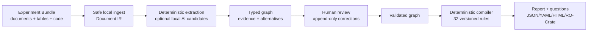

# N-Truth

[](https://github.com/Massimilianociconte/N-truth/actions/workflows/ci.yml)
[](https://www.python.org/)
[](LICENSE)
[](docs/system-card-v0.1.md)

N-Truth is a local-first, human-in-the-loop platform for reconstructing biological
experimental designs. It turns Methods, captions, sample sheets, metadata and
statistical code into a typed, versioned graph, then applies inspectable deterministic
rules to expose experimental units, dependencies, inference scope, conditional values
of `n`, missing information and decisive questions.

> N-Truth is research software in alpha status. It does not certify statistical
> validity, reproducibility, research integrity, privacy compliance or adherence to
> DRIVER/NC3Rs. It does not replace a biostatistician or domain expert. A pinned local
> base model and a reproducible MLX pipeline are available, but no scientifically
> trained N-Truth model, gold corpus or externally validated performance claim exists.

Repository: [github.com/Massimilianociconte/N-truth](https://github.com/Massimilianociconte/N-truth)<br>
Issues: [bug reports and feature requests](https://github.com/Massimilianociconte/N-truth/issues)<br>
Security: [private reporting policy](SECURITY.md)

## What N-Truth does

- safely imports TXT/Markdown, JATS/XML, DOCX, text-based PDF, CSV/XLSX and R/Python/R
  Markdown;
- never executes imported statistical code;
- segments multiple experimental blocks instead of assigning one label to a paper;
- keeps allocation level, application level and observation level distinct;
- represents factors, contrasts, endpoints, targets, estimands, pairing, blocking,
  pooling, nesting, repeated measures and declared clustering;
- distinguishes declared, allocated, analyzed, observational and independent counts;
- abstains or emits explicit scenarios when a decisive fact is unknown;
- separates design replication, analytical dependence and inference scope;
- supports evidence-linked human corrections, append-only revisions, undo/redo and
  candidate-annotation export;
- exports JSON, YAML, HTML, graph JSON, JSON-LD/RO-Crate and machine-readable schemas;
- scans locally for privacy indicators and denies sharing/redistribution by default.

It does **not** perform OCR, choose a definitive statistical test, upload files or grant
rights to use third-party data. The optional MLX lane can prepare governed data,
fine-tune and evaluate a local candidate-fact parser; it is not invoked by the default
CLI/API/UI and remains blocked for scientific training until the human/data gates are
satisfied.

## Scientific model

Every rule answers exactly one of three questions:

| Class | Meaning |
|---|---|
| `DESIGN_REPLICATION` | Is the factor replicated across independently allocable units? |
| `ANALYTICAL_DEPENDENCE` | Does the analysis represent correlation between observations? |
| `INFERENCE_SCOPE` | Does the claim stay within the population and hierarchy actually replicated? |

An experimental unit is always relative to a factor and contrast. A hierarchical model
can represent dependence but cannot create missing biological replication. Author
phrases such as “independent experiments” remain assertions unless structural,
tabular, adjudicated or user-confirmed evidence supports them. When independence is
not established, `n_independent` remains `null` or is represented through conditional
scenarios.

The public normative contract is [N-Truth Public Specification v0.1](docs/public-specification-v0.1.md).
The scientific sources cited by the 32 rules are resolvable in the
[versioned reference registry](docs/scientific-references.md). Rules and their current
10/17/5 class mapping remain candidates pending external wet-lab and biostatistical
review.

## Current status

| Area | Available now | Still required |
|---|---|---|
| Deterministic core | Safe ingest, graph, 32 rules, conditional `n`, positive output | Expert review and 30-60 canonical fixtures |
| Human workflow | Evidence view, editable graph, corrections, revisions, audit, undo/redo | Formal user study and adjudication workflow on real data |
| Interfaces | CLI, loopback FastAPI, React UI | Authentication/multi-user mode is intentionally absent |
| Data governance | Per-asset contracts, privacy scan, lineage and fail-closed distribution gate | Signed authorizations, DPIA where needed and approved corpus manifests |
| Parser AI | Stable JSON contract, local schema-validated generation, retry/reject policy and structured scoring | Integration in the review UI, evaluated few-shot baseline and OOD evaluation |
| Training | Governed preparation, deduplication, group-aware splits, pinned MLX QLoRA, checkpoint/resume, phased early stopping, calibration and adapter export | Approved gold data, frozen real splits, scientific fine-tuning and measured metrics |
| Validation | Synthetic executable tests, challenge fixtures and an isolated two-iteration MLX runtime smoke | Double annotation, IAA/human ceiling and independent external validation |

The repository contains 12 synthetic scientific regressions and 128 executable rule
scenarios (positive, negative, ambiguous and exception for each rule). These verify
software contracts; they are not an adjudicated corpus.

## Architecture



The rules engine reads the validated graph, never raw prose. Candidate parser facts are
untrusted until schema, reference, coordinate and evidence-span validation succeeds.
The CLI, API and UI call the same application layer. See
[architecture and invariants](docs/architettura.md) and the
[repository map](docs/repository-structure.md).

## Requirements

### Core

- macOS (Apple Silicon) or Linux x86-64;
- Python 3.12 or newer;
- [`uv`](https://docs.astral.sh/uv/) with the committed `uv.lock`.

### API/UI and development

- Node.js 20.19 or newer;
- pnpm 11.9.0, as declared in `apps/desktop/package.json`.

### Optional local ML lane

- macOS on Apple Silicon;
- 24 GiB unified memory for the committed initial profile;
- at least 52.2 GiB free for the model-only download gate, and 85.5 GiB free before
  allocating the full 35.5 GiB workspace while retaining the 50 GiB safety floor;
- [`mlx-lm`](https://github.com/ml-explore/mlx-lm) 0.31.3, installed by the locked
  `ml` extra.

No database, cloud account, API key or GPU is required for the deterministic baseline.
The ML extra is intentionally unavailable on non-Apple platforms; the deterministic
core and CI remain portable. There is no PyPI release yet; install from this checkout
or from a verified local wheel.

## Installation

Clone the official repository and enter it:

```bash
git clone https://github.com/Massimilianociconte/N-truth.git
cd N-truth
```

Install only the deterministic core:

```bash
uv sync --locked
```

Add the local API:

```bash
uv sync --extra api --locked
```

Set up a contributor environment:

```bash
uv sync --extra dev --extra api --locked
pnpm --dir apps/desktop install --frozen-lockfile
```

On an Apple Silicon Mac, add the optional MLX lane:

```bash
uv sync --extra dev --extra api --extra ml --locked
uv run ntruth-ml check
```

`check` exits with code 2 until the pinned base snapshot is present. Downloading is a
separate, explicit and license-acknowledged operation:

```bash
uv run ntruth-ml download-model --confirm-license-and-download
uv run ntruth-ml verify-model
```

The selected snapshot is
[`mlx-community/Qwen3-4B-Instruct-2507-4bit`](https://huggingface.co/mlx-community/Qwen3-4B-Instruct-2507-4bit),
pinned to revision `50d427756c6b1b2fe0c0a10f67fbda1fc8e82c1b`. It and its
Apache-2.0 base license are verified locally and stored below `models/local/`, which is
ignored by Git.

`uv.lock` is authoritative. Do not replace a locked command with an unconstrained
`pip install` when reproducing a result or release gate.

## 60-second CLI quickstart

Inspect the software and bundled rules:

```bash
uv run ntruth version
uv run ntruth rules list
uv run ntruth rules show MIC-004
```

Analyze a public synthetic fixture:

```bash
uv run ntruth analyze \
  tests/scientific_fixtures/uc02_preparations/methods.md \
  --out ./ntruth-out \
  --lang it \
  --domain quantitative_microscopy \
  --acknowledge-unvalidated-domain
```

The acknowledgement confirms only that the domain warning was read. It does not
validate the domain or accept a scientific conclusion.

Each run receives an isolated directory:

```text
ntruth-out/runs/<run-id>/
├── project/                 # copied local source and project manifest
└── revisions/0000/
    ├── report.json
    ├── report.yaml
    ├── report.html
    ├── graph.json
    ├── design-specification.json
    ├── design-compilation.json
    ├── parser-ai-input.schema.json
    ├── parser-ai-output.schema.json
    ├── privacy-scan.json
    ├── share-readiness.json
    └── ro-crate-metadata.json
```

Open `report.html` locally. Verify a reusable project before further work:

```bash
uv run ntruth verify ./ntruth-out/runs/<run-id>/project
```

Use `--project /absolute/path/to/project` only when intentionally appending to an
existing local workspace. Without it, runs are isolated and previous output is not
overwritten.

## Local API and UI

Build the bundled UI and start the loopback server:

```bash
pnpm --dir apps/desktop install --frozen-lockfile
pnpm --dir apps/desktop build
uv run ntruth-api
```

Then open:

- application: `http://127.0.0.1:8765/app/`
- OpenAPI documentation: `http://127.0.0.1:8765/docs`
- health check: `http://127.0.0.1:8765/v1/health`

```bash
curl --fail http://127.0.0.1:8765/v1/health
```

The API is unauthenticated, single-user and intentionally hard-coded to
`127.0.0.1:8765`. It accepts local paths and holds at most 16 recent editing sessions
in memory; restarting it clears those sessions, while append-only run artifacts remain
on disk. Never bind it to `0.0.0.0`, expose it to a LAN/Internet, or place it behind a
reverse proxy.

For UI development, run the API and, in a second terminal:

```bash
pnpm --dir apps/desktop dev
```

Open `http://127.0.0.1:5173/app/`; Vite proxies API requests to the loopback server.

## Configuration

The core reads one optional environment variable:

| Variable | Required | Meaning |
|---|---|---|
| `NTRUTH_RULESETS` | No | One or more external ruleset directories, separated by the operating-system path separator (`:` on supported macOS/Linux). External paths take precedence over bundled rules. |

Example:

```bash
export NTRUTH_RULESETS="/absolute/path/to/reviewed-rulesets"
uv run ntruth rules list
```

N-Truth does not load `.env` automatically. `.env.example` is documentation only; do
not put tokens, passwords or private-data paths in it. The deterministic application
requires no credentials.

## Supported input and safety behavior

| Input | Support and limits |
|---|---|
| TXT/Markdown | Local text and headings |
| JATS/XML | Sections, references and evidence coordinates |
| DOCX | Text/tables from safe, bounded archives; macros are not executed |
| PDF | Extractable text only; no OCR in the baseline |
| CSV/XLSX | Sheets, types and formulas; formulas are data, never instructions |
| R/Python/R Markdown | Read-only extraction; `never_execute` policy |

Corrupt, oversized, traversal-bearing, macro-bearing or unsupported inputs fail
explicitly. Formula injection, prompt injection and imported code are treated as
untrusted content. See [Security Policy](SECURITY.md).

## Human correction workflow

1. Run an analysis and open the local evidence/graph view.
2. Select an experiment block and inspect the evidence for the candidate fact.
3. Confirm, reject or apply a constrained patch with rationale and reviewer role.
4. Review the diff and the recalculated deterministic output.
5. Use undo/redo when needed; every action remains in the audit trail.
6. Export candidate annotations only after reviewing evidence and alternatives.

Corrections create new revision directories. They never mutate source files or promote
an annotation to gold. Candidate exports remain `training_eligible=false` until an
independent reviewer and adjudicator explicitly promote them.

## Data governance and distribution checks

Every analysis writes `privacy-scan.json` and `share-readiness.json`; sharing and
redistribution are denied by default. To evaluate a specific revision:

```bash
uv run python scripts/create_governance_template.py \
  ./ntruth-out/runs/<run-id>/revisions/<revision> \
  --out /absolute/private/path/governance.pending.json

uv run ntruth distribution-check \
  ./ntruth-out/runs/<run-id>/revisions/<revision> \
  --governance /absolute/private/path/governance.reviewed.json \
  --action share \
  --privacy-policy acknowledged \
  --acknowledgement-reference local://privacy-review/<review-id>
```

The governance file must contain records whose asset IDs and SHA-256 values exactly
match `share-readiness.json`, plus immutable evidence of authorization and any required
per-asset license manifest. `blocked` always denies distribution. `acknowledged`
requires an explicit review reference. `redacted_copy` requires a complete redaction
manifest and exact derivative content for every finding.

The command performs a local fail-closed evaluation only: it never copies, uploads or
shares a file. Start from the scope-bound procedure in the
[governance workflow](docs/governance-workflow.md), then see
[data governance](docs/data-governance-v3.md),
[data-sharing checklist](docs/data-sharing-agreement-checklist.md) and
[privacy/DPIA screening](docs/privacy-dpia-screening.md).

## Data collection, annotation and model development

Real or downloaded data must live in `local-data/`, which is ignored by Git. The
expected local layout is:

```text
local-data/
├── raw/incoming/
├── metadata/assets/
├── metadata/sources/
├── annotations/{pending,double-reviewed,adjudicated}/
├── prepared/<snapshot>/
├── evaluation/<run>/
├── cache/
└── quarantine/
```

An acquired file stays immutable in `raw/incoming` with split `unassigned`. Promotion
requires asset-level license evidence, provenance, SHA-256, privacy review,
deduplication and a whole-bundle leakage group. Article, revisions/preprint,
supplements, sample sheet, code, repository accessions and mirrors must remain in one
split. Synthetic/template data may enter training only; validation, test and external
sets are frozen before optimization.

The repository now includes an operational standalone preparation and MLX execution lane.
Its normal path rejects non-eligible annotations, conflicting labels, cross-split
leakage and unapproved or altered snapshots. Content-addressed schema v2 manifests are
verified back to prepared records, approvals and exact chat rows; run state binds the
`best` adapter to that snapshot. Final export requires test/external metrics and
validation-only calibration from the same verified lineage, with metrics and
confidence reconstructed from predictions and manifest gold. A deliberately isolated
synthetic smoke mode exists only to verify the runtime and cannot produce scientific
metrics or an exportable bundle.

The end-to-end command sequence is:

```bash
uv run ntruth-ml prepare /absolute/private/approved-records.jsonl \
  --out local-data/prepared/corpus-v1
uv run ntruth-ml tokenize local-data/prepared/corpus-v1 \
  --out local-data/prepared/corpus-v1/token-report.json
uv run ntruth-ml train local-data/prepared/corpus-v1 \
  --out models/runs/corpus-v1-seed13 --seed 13
uv run ntruth-ml predict local-data/prepared/corpus-v1/valid.jsonl \
  --adapter models/runs/corpus-v1-seed13/best \
  --out local-data/evaluation/corpus-v1-validation --split validation
uv run ntruth-ml calibrate \
  local-data/evaluation/corpus-v1-validation/confidence-observations.jsonl \
  --out local-data/evaluation/corpus-v1-calibration.json \
  --fit-split validation
uv run ntruth-ml predict local-data/prepared/corpus-v1/test.jsonl \
  --adapter models/runs/corpus-v1-seed13/best \
  --out local-data/evaluation/corpus-v1-test --split test
uv run ntruth-ml export-adapter models/runs/corpus-v1-seed13 \
  --dataset-manifest local-data/prepared/corpus-v1/snapshot-manifest.json \
  --metrics local-data/evaluation/corpus-v1-test/metrics.json \
  --calibration local-data/evaluation/corpus-v1-calibration.json \
  --out models/exports/corpus-v1-seed13
```

These commands are operational, but real fine-tuning must not begin until expert review,
20 stable real designs, 30-60 canonical fixtures, 30 double-annotated calibration cases,
a frozen pilot protocol, approved rights and bundle/laboratory-aware splits. See the
[MLX training pipeline](docs/mlx-training-pipeline.md), the
[dataset assessment](docs/dataset-assessment.md),
[data and model development](docs/data-and-model-development.md), the
[Data Card](docs/data-card-v0.1.md), [Model Card gates](models/cards/README.md) and the
[validation protocol draft](docs/validation-protocol-draft.md).

Never commit or publish `local-data/`, `data/raw/`, real annotations, source documents,
raw predictions, model/cache directories, adapters, checkpoints, runs or exports
without explicit authorization.

## Development and test commands

From a contributor installation:

```bash
uv lock --check
uv run ruff check .
uv run ruff format --check .
uv run mypy packages
uv run pytest
pnpm --dir apps/desktop test
pnpm --dir apps/desktop build
uv run python scripts/generate_sbom.py --check sbom.cdx.json
uv build
uv run python scripts/check_distribution.py
uv run python scripts/smoke_release.py
uv run ntruth-ml --help
```

On Apple Silicon, also run
`uv run python scripts/smoke_release.py --include-ml`; it installs the optional ML
extra from wheel and sdist without downloading model weights.

The release smoke test installs the wheel and rebuilds/installs the source distribution
in separate clean environments, then checks the CLI, bundled rules and local API health
contract. A green suite demonstrates the tested software contracts; it does not
demonstrate accuracy on real documents, human agreement or external validity.

See [Contributing](CONTRIBUTING.md), the [release procedure](docs/releasing.md) and
[Code of Conduct](CODE_OF_CONDUCT.md).

## Troubleshooting

- **Domain acknowledgement required:** rerun with
  `--acknowledge-unvalidated-domain` only after reading the warning.
- **Ruleset not found:** run `uv run ntruth rules list` and verify
  `NTRUTH_RULESETS`; N-Truth does not auto-load `.env`.
- **PDF produces no content:** the baseline does not perform OCR; use a separately
  reviewed OCR workflow and retain the original.
- **UI is missing/stale:** rebuild it with `pnpm --dir apps/desktop build` before
  starting `ntruth-api`.
- **Port 8765 is occupied:** inspect the exact listener with
  `lsof -nP -iTCP:8765 -sTCP:LISTEN`; do not use broad `pkill` commands.
- **Distribution denied:** this is the safe default; inspect checksums, permission,
  license and privacy records rather than bypassing the gate.
- **`ntruth-ml check` exits 2:** read its `checks` object; the model is intentionally
  absent in a clean clone until the explicit download command is run.
- **MLX is unavailable:** the `ml` extra requires Apple Silicon macOS. Use the
  deterministic core on Linux/CPU or run the ML lane on supported hardware.

Full guidance: [Troubleshooting](docs/troubleshooting.md) and [Support](SUPPORT.md).

## Current limitations and roadmap

Release-blocking scientific work still requires people and data:

- independent wet-lab and biostatistical review of definitions and all principal rules;
- 30-60 complete canonical, referenced and reviewed fixtures;
- authorized real Experiment Bundles and a double-annotated pilot;
- IAA, adjudication, determinability rate and human-ceiling estimates;
- evaluated constrained parser baseline, calibration, abstention and OOD detection;
- external validation on unseen laboratories/techniques and a crossover user study.

Engineering roadmap items include integration of the optional ML parser in the review
UI, active learning after evaluation-set freeze, optional OCR adapters with provenance,
persistent/multi-user deployment with authentication, and a scientifically trained
parser only after the published gates.
See [PRD v3 reconciliation](docs/prd-v3-reconciliation.md) and the
[first human steps checklist](docs/first-human-steps-checklist.md).

## Documentation index

- [Public Specification v0.1](docs/public-specification-v0.1.md)
- [Architecture and invariants](docs/architettura.md)
- [Repository structure](docs/repository-structure.md)
- [Scientific references](docs/scientific-references.md)
- [Annotation Guideline draft](docs/annotation-guideline-v0.1.md)
- [Design Specification](docs/design-specification-v0.1.md)
- [Parser AI contract](docs/parser-ai-contract.md)
- [Data governance](docs/data-governance-v3.md)
- [Governance and distribution workflow](docs/governance-workflow.md)
- [Data/model development](docs/data-and-model-development.md)
- [Dataset assessment and acquisition decisions](docs/dataset-assessment.md)
- [Reproducible MLX training pipeline](docs/mlx-training-pipeline.md)
- [Data Management Plan draft](docs/data-management-plan-draft.md)
- [Validation protocol draft](docs/validation-protocol-draft.md)
- [System Card](docs/system-card-v0.1.md) and [Data Card](docs/data-card-v0.1.md)
- [Release procedure](docs/releasing.md) and [Troubleshooting](docs/troubleshooting.md)

## Contributing, citation and license

Contributions are welcome through issues and pull requests. Scientific changes must
include executable edge cases and must not be called approved before external review.
Read [CONTRIBUTING.md](CONTRIBUTING.md), [CODE_OF_CONDUCT.md](CODE_OF_CONDUCT.md) and
[SECURITY.md](SECURITY.md) first.

Citation metadata is available in [CITATION.cff](CITATION.cff). Until a tagged release
or archival DOI exists, cite the exact Git commit in addition to the project title and
repository URL.

Original code, documentation, rulesets, ontology and synthetic fixtures in this
repository are licensed under [Apache License 2.0](LICENSE), unless a file explicitly
states otherwise. This license does not extend to imported papers, datasets,
laboratory material, restricted annotations or model weights.

N-Truth is an independent project. It is not an NC3Rs product, does not reproduce the
DRIVER resource and must not imply endorsement or certification.
