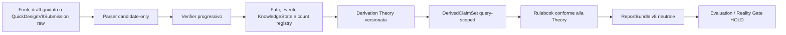

# Architettura N-Truth — PRD v8.0

Questo documento descrive l’architettura corrente del clean checkout. La mappa
machine-readable con path, API, ownership, test, evidenze e blocker è
[architecture/prd-v8-current-to-target.yaml](architecture/prd-v8-current-to-target.yaml).

Stato complessivo: **`IMPLEMENTED_WITH_EXPLICIT_BLOCKERS`**. “Implementato” indica
un contratto software verificabile; non implica validazione scientifica, gold reale o
autorizzazione al training.

## Flusso canonico



L’ordine è un vincolo: il Rulebook non definisce la teoria e il parser non emette
claim finali. La pipeline canonica richiede un `ConformanceBundle` checksum-verificato
e riesegue la derivazione al boundary di verifica/report.

## Strati e ownership

| Strato | Responsabilità | Moduli principali |
|---|---|---|
| Core Semantic Kernel | Identità, stato epistemico, fonti/evidenze, query e schemi strict | `schemas/kernel.py`, `schemas/knowledge.py`, `schemas/support.py` |
| Grafo/eventi | Unità, relazioni, assignment/application/exposure/timing e uguaglianza esatta | `schemas/graph_v8.py`, `schemas/events.py`, `graph/equality_v8.py` |
| Count Registry | Count kind e scope completi, separazione EU/source/planned/observed | `schemas/count_registry.py`, `schemas/counts.py` |
| Derivation Theory | Clausole scientifiche immutabili e closure dei predicati | `derivation_theory/`, `theories/` |
| Rulebook/conformance | Implementazione clause-pinned e fixture positive/negative/counterfactual | `conformance/`, `rulesets/ntruth-v8-core-0.1.0.json` |
| Runtime v8 | Orchestrazione sottile, proof verification, re-derivation | `pipeline_v8.py`, `verifier/v8.py` |
| Prospective/report | Piano, esecuzione, reconciliation, query sections, handoff neutrale | `schemas/prospective.py`, `schemas/report_bundle.py`, `reporting/v8.py` |
| Parser/training boundary | Candidate-only, Gold adjudicato, split protetti, byte sealing | `parser_ai/`, `mvt_a/`, `training/` |
| Evaluation/governance | E2E, residual, cluster, contamination, custody e policy | `evaluation_v8/`, `governance/contamination.py` |
| Reality Gate | Sei dimensioni, blocker completi, decisione fail-closed | `reality_gate/v8.py` |
| Interface | CLI/API v8 canoniche, adapter v7 qualificati, desktop neutrale | `cli/main.py`, `api/app.py`, `apps/desktop/` |

## Moduli deterministici ereditati

Il checkout contiene anche il core deterministico pre-v8, che resta la fondazione
software dell’ingestione, della revisione umana e del reporting locale:

| Package | Responsabilita |
|---|---|
| `ntruth.schemas` | Document IR, manifest, Experiment Graph, conteggi, regole e report |
| `ntruth.ingest` | Progetto locale, manifest, checksum, profilo input e controlli di sicurezza |
| `ntruth.storage` | SQLite locale, migrazioni, revisioni/audit e blob store content-addressed |
| `ntruth.parsers` | Byte -> testo, sezioni, tabelle e code artifact con coordinate; codice `never_execute` |
| `ntruth.sample_sheet` | Schema v6, generazione, validazione e I/O CSV sicuro |
| `ntruth.prospective` | Compiler D0 e contratti separati planned/executed con deviazioni tipizzate |
| `ntruth.extract` | Segmentazione e baseline deterministica di candidate fact |
| `ntruth.parser_ai` | Contratti staged e superficie legacy; nessun peso incluso |
| `ntruth.runtime_resources` | Profili benchmark-derived, scheduling sequenziale, chunking, cache, fallback e telemetria |
| `ntruth.graph` | Costruzione, validazione, unita per scope e determinabilita |
| `ntruth.verifier` | Verifica hard e matrice normativa degli output |
| `ntruth.rules` | Ruleset versionati, predicati ed esecuzione con trace |
| `ntruth.design` | Target/estimando, elicitazione e compilation del disegno |
| `ntruth.corrections` | JSON Patch validate, ledger, undo/redo, audit e ricalcolo |
| `ntruth.reporting` | Output positivo, JSON/YAML/HTML, graph e metadati di export |
| `ntruth.governance` | Autorizzazioni, privacy, lineage, snapshot e split anti-leakage |
| `ntruth.training` | Gold target contract, preparazione e tooling MLX locale |
| `ntruth.api` | API locale loopback e sessioni bounded |
| `ntruth.cli` | Comandi locali e messaggi di errore espliciti |
| `ntruth.pipeline` | Orchestrazione deterministica locale |

Questi moduli verificano contratti software; non costituiscono validazione scientifica
e non aggirano i blocker registrati.

## Contratti scientifici fondamentali

### Determinabilità, adequacy e risoluzione

`DerivedClaim.determinability_state` è claim-specifico. Un claim `DETERMINATE` può
coesistere con un’adequacy negativa, positiva, non valutata o sconosciuta. La
`ReportResolutionOutcome` aggrega il report senza trasformarsi in un giudizio sul
disegno. Dove la precedenza multi-query non è specificata, `SRR-V8-014` blocca una
risoluzione inventata.

### Cinque assi non sostituibili

- assignment independence;
- biological-source independence;
- exposure/interference;
- analytical independence;
- measurement-process independence.

Nessun asse è proxy di un altro. L’interference non cambia automaticamente EU;
topologie non chiuse restano `NON_EXHAUSTIVE`/`SRR-V8-017`.

### Open-world semantics

I campi scientifici usano `KnowledgeValue` con sei stati: `PRESENT`,
`ABSENT_EXPLICIT`, `NOT_REPORTED`, `UNKNOWN`, `NOT_APPLICABLE`, `CONFLICTING`.
Presenza e assenza esplicita richiedono evidenza; N/A richiede rationale e scope;
un conflitto conserva valori ed evidenze. Bare `null` o liste vuote non possono
sostituire una decisione epistemica.

### Query e count scope

Claim, adequacy, domande e count sono legati a `InferentialQuery`. La Canonical Count
Registry distingue almeno planned, observed, experimental-unit, biological-source,
analytical e diagnostic counts. La riconciliazione è kind-aware e scope-aware.
Conteggi, quantificatori, lifecycle ed esclusioni non vengono compressi in un solo
`n`; l’unità sperimentale è derivata per fattore, contrasto ed endpoint, non per
paper.

### Piano ed esecuzione

`PlannedDesignRecord` e `ExecutedDesignRecord` sono immutabili, content-addressed e
mantengono ledger separati. La reconciliation descrive deviazioni senza sovrascrivere
il piano. Le fonti PLANNED ed EXECUTED non vengono collassate a parità di ID.

### Parser e correzioni

Il parser produce solo candidate facts/graph. `n`, EU, determinabilità, adequacy e
rule verdict appartengono al verificatore/teoria. Una correzione non può patchare
`DerivedClaimSet`; usa fatti/conferme o un `RuleChallenge`, poi ricalcola.

Ogni `CandidateExperimentBlock` ha esattamente un `CandidateBlockBoundary` con
evidenza e rationale. Il record scientifico resta separato: `CONFIRMED` richiede un
`ConfirmationEvent` con scope, valore ed evidenze identici; `CONFLICTING` conserva le
alternative. Split e merge sono record append-only tipizzati, mai sovrascritture.
Statistical code e author assertion non provano da soli allocazione o indipendenza;
un’incertezza decisiva produce astensione, alternative o rami condizionali.

## Artefatti scientifici distinti

| Artefatto | Ruolo | Stato repository |
|---|---|---|
| Derivation Theory | Fonte scientifica eseguibile | Presente, versionata |
| Rulebook | Implementazione della Theory | Presente e conformance-gated |
| Implementation Conformance Fixtures | Closure ingegneristica delle clause | Presenti, sintetiche |
| Theory Reference Set | Riferimento umano revisionato | Assente, `SRR-V8-021` |
| Derivation Gold | Claim reali adjudicati | Assente, `SRR-V8-022` |

Fixture sintetiche verdi non possono essere riclassificate come Reference Set o Gold.

## Reporting e statistica

Il `ReportBundle` include context/fonti, query sections, claim sets, adequacy,
Scenario/Profile Coverage, count registry, conflitti, sensitività, conferme, domande,
grafo, manifest e limiti. JSON, YAML e HTML rivalidano checksum e shape.

Lo strategy module è sempre `HANDOFF_ONLY`: può trasmettere requisiti strutturali e
domande, mai scegliere test, formula, soglia o modello.

## Evaluation e Reality Gate

Le interfacce v8 coprono denominatori report/query/claim/axis, proof/evidence,
false-certainty, residual audit cieco, reference stability e precisione cluster-aware.
Senza reference e protocolli esterni revisionati mantengono blocker e non autorizzano
uso scientifico.

Reality Gate v8 valuta sei dimensioni e pin completi. Il training riconcilia i pin
prima di accedere a snapshot, record, modello, staging o subprocess. `TEST` e
`EXTERNAL_CHALLENGE` non sono mai training/model-selection eligible. La decisione
corrente resta HOLD.

## Persistenza locale

Ogni progetto creato dalla pipeline contiene:

```text
project/
├── manifest.json
├── sources/
│   └── <copie locali registrate>
├── blobs/
│   └── sha256/<prime-2-cifre>/<sha256-completo>
└── ntruth.sqlite3
```

`sources/` e mantenuta per compatibilita e accesso locale. Il blob store e immutabile,
deduplica per contenuto, pubblica atomicamente e verifica digest e dimensione. SQLite
registra progetti, blob, collegamenti progetto-blob, revisioni, sessioni, run, eventi
di audit e migrazioni. Usa foreign key, WAL, `synchronous=FULL`, transazioni e
savepoint; trigger impediscono update/delete di revisioni ed eventi di audit.

L’apertura di un workspace precedente esegue un backfill non distruttivo nel blob
store soltanto quando la copia legacy corrisponde al checksum. Il comando
`ntruth verify` ricontrolla copia sorgente e blob.

SQLite e il backend locale iniziale. PostgreSQL o un graph database non sono
funzionalita collaborative dichiarate come implementate.

## Trust boundary degli input

Il core non apre indiscriminatamente ogni file:

- D0 accetta TXT, Markdown e CSV semplice;
- formati complessi richiedono `extended_experimental`;
- estensione e firma/media type devono essere coerenti;
- symlink, traversal, macro e archivi/input oltre i limiti sono rifiutati;
- JATS/XML non puo contenere `DOCTYPE` o `ENTITY`;
- script statistici sono dati testuali e non vengono mai eseguiti;
- il contenuto di una fonte e sempre dato, mai istruzione per il sistema.

Il profilo e persistito nel manifest. Un workspace non puo essere riaperto con un
profilo differente senza creare un progetto separato.

## Governance e rete

Le autorizzazioni `analyze`, `annotate`, `train`, `share` e `redistribute` sono
separate. Un record mancante, scaduto, revocato o incoerente con il checksum nega
l’azione governata. Lo scanner privacy e assistivo e produce finding stand-off;
`distribution-check` valuta un gate e non trasferisce file.

La API baseline e single-user, senza autenticazione e destinata al loopback. Non deve
essere pubblicata su `0.0.0.0`, reverse proxy, LAN o Internet.

## Boundary applicativi

- Il desktop usa `POST /v8/quick-design/build-submission`: PREVIEW è review-only e
  CONFIRM produce il risultato canonico nella stessa richiesta, senza richiedere JSON
  all'utente e senza restituire una capability di riesecuzione.
- `ntruth quick-design run` e `/v8/quick-design` sono superfici v8 raw-author-asserted
  esplicite per automazione e ispezione.
- `ntruth analyze` e `/v1/analyze` falliscono chiuso per raw input non qualificato.
- `analyze-v7`, `quick-design run-v7`, `/v7/analyze` e `/v7/quick-design` sono
  adapter espliciti con marker `DEPRECATED_V7_ADAPTER`.
- Il desktop costruisce il draft guidato, conserva la coda di revisione non ordinata
  scientificamente (`SRR-V8-025`) e mostra il `ReportBundle v8` con assi separati,
  `NON_EXHAUSTIVE`, blocker e `HANDOFF_ONLY` senza palette “green ready”.

## Package e clean-checkout truth

Wheel e sdist includono Theory, Rulebook, conformance fixtures, registry degli
esempi e snapshot JSON Schema runtime-derived. Il gate
`scripts/check_prd_v8_contracts.py` verifica map, link, esempi e schema; il gate
`scripts/check_repository_policy.py` controlla NO_CORPUS/privacy/secret/large-file.
Quest’ultimo è detection-only e non costituisce un’attestazione.

## Blocchi aperti

Le decisioni aperte sono in
[audits/prd-v8-full-migration/SCIENTIFIC_REVIEW_REGISTER.md](audits/prd-v8-full-migration/SCIENTIFIC_REVIEW_REGISTER.md).
La chiusura richiede decisione umana append-only, versioni coinvolte e re-derivazione;
non basta aggiornare uno schema o rendere verde un test.

Per i confini operativi vedere [Core Profile D0](core-profile-d0.md),
[SampleSheetSpec v6](sample-sheet-v6.md) e
[contratto parser/verifier](parser-ai-contract.md).
