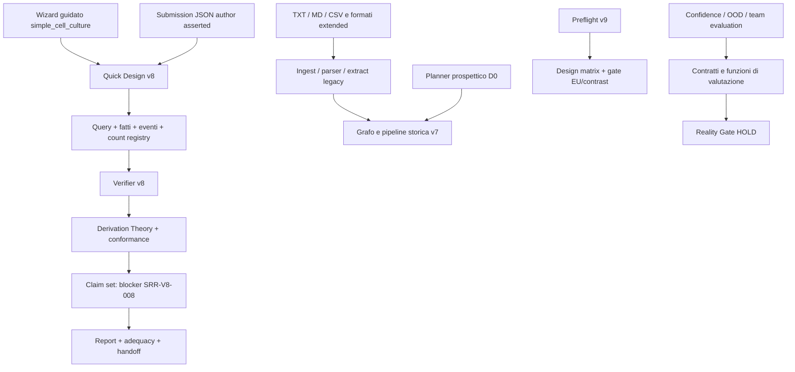

# N-Truth — audit scientifico e architetturale

Data: 12 settembre 2026. Checkout: `57b74436cdcec2a5288059226f2c87b2c85079de`, con modifiche locali preesistenti. Revisione del worktree disponibile, non certificazione del solo commit.

**Giudizio:** N-Truth è un'infrastruttura di formalizzazione e revisione scientifica articolata, con buone separazioni concettuali e numerosi controlli di integrità. Non è ancora dimostrato come strumento affidabile per identificare le repliche indipendenti negli studi reali. Oltre ai blocker dichiarati, l'audit trova difetti riproducibili nei controlli del disegno, nelle metriche di sicurezza, nella conservazione degli input e nella coerenza dei fatti. Il passo decisivo è chiudere un percorso scientifico ristretto e verificabile con evidenza indipendente, prima di estendere tassonomie, modelli e versioni.

Nessun sorgente applicativo, dato scientifico, gate o modifica preesistente è stato alterato. Sono stati aggiunti soltanto gli artefatti di questo audit. Nessun training, acquisizione di corpus, deploy o invio di dati.

## 1. Metodo, copertura e limiti

Inventario automatico di **848 file** visibili alle regole di ricerca, tra cui **268 moduli Python applicativi, 89.432 righe**, 260 file sotto tests, 48 sotto apps, 129 sotto docs prima dell'aggiunta di questo audit. Non sono 260 test: sono file, comprese fixture. La raccolta pytest seleziona 4.035 casi non-performance.

L'inventario include tutti i moduli Python individuati e le loro definizioni/import interni; la revisione semantica è stata approfondita sui percorsi decisivi per la domanda scientifica. Non equivale a una lettura manuale di ogni riga degli 848 file. Sono stati esaminati architettura e contratti, runtime e verifier, grafi e conteggi, preflight v9, percorsi Quick Design/D0/legacy, ingest, confidence/calibrazione, governance e protocolli. Le analisi di dettaglio sono separate in SCIENCE.md, VALIDATION.md e SURFACES.md.

La verifica comprende controesempi eseguiti, test locali e confronto con fonti scientifiche primarie. Non comprende un corpus reale adjudicato, un audit formale di sicurezza, un test hardware completo, né la validazione di modelli o dati fuori repository. Non sono stati aperti PDF locali: i difetti del parser PDF sono stati verificati con griglie in memoria e mock, senza eludere la policy PDF Inspector.

Livelli di evidenza usati:

- **Bug riprodotto:** comportamento osservato con input concreto; viene indicato se a livello componente o pipeline.
- **Limite implementativo:** funzionalità assente, scollegata o bloccata; non confusa con errore di esecuzione.
- **Problema metodologico:** inferenza sulla validità scientifica o sul programma di valutazione; richiede decisione/revisione, non si risolve cambiando una riga.
- **Non verificato:** conclusione che questo audit non autorizza.

## 2. Che cosa deve significare «n realmente indipendente»

Il prodotto non dovrebbe promettere un numero indipendente assoluto ricavabile dal documento. Dovrebbe ricostruire, per una domanda esplicita, le unità di assegnazione, le fonti biologiche, le osservazioni, le dipendenze e le assunzioni sotto cui una specifica inferenza è sostenibile.

L'unità sperimentale dipende dall'intervento e dal disegno. Misurare più cellule dello stesso animale trattato non crea nuove assegnazioni dell'intervento. Applicare separatamente un intervento a preparazioni dello stesso animale introduce invece una questione distinta di replicazione dell'intervento e generalizzazione biologica. La letteratura distingue unità biologiche, sperimentali e osservazionali; il dominio della conclusione conta quanto il numero delle misure. Fonti: [Lazic et al., 2018](https://journals.plos.org/plosbiology/article?id=10.1371/journal.pbio.2005282), [NC3Rs EDA, experimental unit](https://eda.nc3rs.org.uk/experimental-design-unit), [Population sampling affects pseudoreplication](https://journals.plos.org/plosbiology/article?id=10.1371/journal.pbio.2007054).

La distinzione centrale da mantenere nel prodotto è fra:

| Quantità | Domanda cui risponde | Cosa non dimostra |
|---|---|---|
| Numero di fonti biologiche | Quanti donatori, animali, linee o origini distinte sono documentati? | Assegnazione indipendente dell'intervento |
| Numero di unità assegnate | Quante unità sono state allocate al fattore di interesse? | Indipendenza degli esiti o assenza di interferenza |
| Numero di unità osservate/analizzate | Quante unità hanno dati per questo endpoint e lifecycle? | Che esclusioni e missingness siano ignorabili |
| Numero di misure | Quante osservazioni strumentali o sottocampioni esistono? | Nuova replicazione biologica o sperimentale |
| Informazione/precisione effettiva | Quanta informazione c'è sul contrasto sotto un modello esplicito? | Un conteggio universale leggibile dal Methods |

Per esempio, 3 donatori × 2 condizioni × 4 pozzetti × 100 cellule producono 2.400 misure cellulari e 24 pozzetti. Per un confronto appaiato fra donatori ci sono 3 fonti biologiche appaiate; se l'intervento è assegnato ai pozzetti, le unità di assegnazione sono a quel livello. Il numero da usare per quantificare l'incertezza non si ottiene scegliendo automaticamente né 2.400, né 24, né 3 senza specificare estimando e struttura della dipendenza. Questo è un esempio esplicativo, non una raccomandazione di modello statistico.

Un oggetto di output utile dovrebbe quindi contenere: domanda, contrasto effettivo, popolazione bersaglio, endpoint, tempo, lifecycle, unità e conteggi per asse, stato epistemico, dipendenze, evidenze e assunzioni. La presenza degli ID distinti dimostra distinguibilità nel registro, non indipendenza probabilistica. L'assenza di un arco di dipendenza in un grafo incompleto non è prova di assenza di dipendenza.

## 3. Mappa del progetto e dei percorsi realmente eseguibili

Questo diagramma distingue percorsi coesistenti. Non rappresenta tutti i moduli come una sola pipeline già integrata.

| Area | File/directory principali | Stato e responsabilità effettiva |
|---|---|---|
| Entrypoint | `cli/main.py`, `api/app.py`, `application.py` | CLI/API locale; percorsi canonici e adapter distinti |
| Desktop | `apps/desktop/src/App.tsx`, `QuickDesignWizard.tsx`, `d0/` | React/Vite, wizard guidato e workspace D0; test sintetici |
| Ingest e sicurezza | `ingest/`, `parsers/`, `ocr/` | MIME, limiti, quarantena, parser; OCR è contratto, non motore integrato |
| Estrazione | `extract/`, `parser_ai/`, `mvt_a/` | Candidate facts e stadi; non autorizzati a derivare n finale |
| Kernel | `schemas/` | KnowledgeState, evidenza, fattori, contrasto, query, eventi, conti, report |
| Grafi | `graph/` | Gerarchie legacy, indice, unità, determinabilità, uguaglianza v8 |
| Teoria | `derivation_theory/`, `theories/` | Clausole versionate, inventario di predicati, pin dell'evaluator |
| Regole e verifier | `rules/`, `verifier/`, `conformance/` | Verifica strutturale, scope, conformance, re-derivazione, adequacy |
| Runtime canonico | `pipeline_v8.py` | Fact verification → derivazione → claim verification → adequacy → risoluzione |
| Sidecar v9 | `scientific/`, `quick_design/v9.py`, `v9_bundle.py` | Ruolo/contrasto, matrice del disegno, identità EU, bundle; integrazione parziale |
| Prospettico | `prospective/`, `design/`, `sample_sheet/` | Piano, esecuzione, differenze, righe e identificatori; contratto D0 legacy separato |
| Reporting/correzioni | `reporting/`, `corrections/` | Report, provenance, Methods, patch e ricalcolo; no selezione di test statistici |
| Persistenza | `storage/`, `api/session_journal.py` | SQLite e blob SHA-256, audit append-only; journal di sessione opt-in |
| Modelli/runtime | `model_backends/`, `runtime_resources/`, `training/` | Backend opzionale MLX, qualifica, risorse, preparazione e training governato |
| Valutazione | `confidence/`, `calibration/`, `evaluation_v8/`, `team_evaluation/`, `abstention/`, `complexity/` | Metriche, risk/coverage, contratti OOD e protocolli; evidenza reale non disponibile |
| Dati/governance | `data/`, `task_corpora/`, `governance/` | Split, diritti, provenienza, contamination e challenge lifecycle |
| Readiness | `reality_gate/`, `contracts/` | Readiness multidimensionale; HOLD, non autorizzazione scientifica |
| Distribuzione | `release/`, `scripts/`, `.github/`, lockfile/SBOM | Packaging, CI, smoke, tracciabilità e controlli di repository |

Dettaglio completo dei moduli: [MODULE_MAP.md](MODULE_MAP.md). Inventario strutturato, definizioni e archi di import: [repository-map.json](repository-map.json).

### Confini che cambiano il giudizio sul prodotto

1. Il wizard guidato principale è limitato a `simple_cell_culture`. L'ampiezza degli schemi non equivale al supporto operativo di ogni disegno complesso.
2. `analyze` raw canonico è bloccato; `analyze-v7` è un adapter storico esplicito. La capacità promessa di leggere materiali eterogenei non è ancora un percorso canonico end-to-end scientificamente qualificato.
3. Il D0 prospettico conserva conteggi legacy; SRR-V8-034 ne dichiara la migrazione necessaria. Non va presentato come equivalente a un bundle v9.
4. V8 richiede nel resolver EU anche `realized_exposure_separability`; il sidecar v9 conserva l'identità di assegnazione con interferenza e declassa il supporto al contrasto. La diversa semantica è esplicita nei moduli, ma richiede un percorso canonico unificato prima di promuovere v9.
5. `ProfileCoverageStatement` impone SRR-V8-008; `_derive_clause_claims` trasforma gli stati potenzialmente determinati in `INSUFFICIENT_INFORMATION`. Con il contratto corrente tutti i claim derivati v8 determinati sono quindi bloccati. È una misura intenzionale di prudenza, non la prova che il problema scientifico sia risolto.
6. Confidence/OOD e team evaluation sono soprattutto contratti/funzioni pure. La presenza di enum e record non dimostra un detector operativo, calibrato e collegato al workflow.

## 4. Difetti riprodotti e loro priorità

P1 = da risolvere prima di usare il componente per conclusioni/decisioni scientifiche; P2 = correttezza o completezza importante, con impatto limitato al percorso indicato; P3 = accessibilità operativa/documentazione. Le priorità non implicano che oggi esista un rilascio scientifico autorizzato.

| ID | Priorità | Difetto | Livello verificato |
|---|---|---|---|
| A01 | P1 | Metrica di falsa sicurezza invertita | Funzione pubblica/aggregatore metriche |
| A02 | P1 | Dato mancante contato come variazione del fattore | Design matrix + decisione contrasto v9 |
| A03 | P1 | Alias fra nuisance estranei invalida il trattamento | Design matrix + decisione contrasto v9 |
| A04 | P1 | Collisione header distrugge celle tabellari | Parser tabellare CSV/XLSX |
| A05 | P2 | Soglia di astensione irrealizzabile con score uguali | Artefatto di calibrazione |
| A06 | P2 | Interferenza incoerente fra aggregate e predicati | Pipeline v8 completa |
| A07 | P2 | Completezza con ricerca controesempi mai eseguita | Schema ScenarioCoverage |
| A08 | P2 | Assegnazioni parziali diventano conteggi esatti/zero | GraphIndex legacy |
| A09 | P2 | Tabelle PDF troncate senza warning | Conversione di griglia in memoria |
| A10 | P2 | PDF misto: pagina senza testo non qualificata per pagina | Parser con mock |
| A11 | P2 | Gate esempi normativi PASS con zero esempi | Script nel checkout |
| A12 | P3 | Quickstart Reality Gate non eseguibile | CLI |

### A01. La metrica di errore critico conta i casi corretti

`packages/ntruth/confidence/records.py:324` usa `label == 1` nel numeratore di `false_high_confidence_critical_error_rate`; le altre metriche dello stesso aggregatore usano 1=corretto e 0=errore.

- confidence .99, risposta errata e critica: rischio 1.0, ma metrica falsa sicurezza **0.0**;
- confidence .99, risposta corretta e critica: rischio 0.0, ma metrica falsa sicurezza **1.0**.

È l'inversione dell'indicatore che dovrebbe sorvegliare gli errori più pericolosi. Alcuni test codificano proprio l'attesa errata: questo rende evidente perché una suite può essere verde senza un oracolo indipendente.

**Miglioramento:** evento di errore tipizzato e unico; correggere il predicato; documentare denominatore e direzione; tabella di verità indipendente su corretto/errato × critico/non critico × alta/bassa confidence. Nessun uso di questa metrica per promozioni prima della correzione. Non è stato dimostrato che oggi il runtime principale prenda decisioni su tale valore.

### A02. Missingness scambiata per variazione reale

`scientific/design_matrix.py:87-89` ignora un fattore mancante, ma `:124-126` include `None` nell'insieme dei livelli del blocco.

Esempio: blocco b1 con u1=control e u2 senza assegnazione; blocco b2 con u3=treated. La funzione dichiara `within_block_variation=True`, perché `{control, None}` ha cardinalità 2. Con gli altri flag positivi il risultato diventa `SUPPORTED_WITHIN_RECORDED_DESIGN`.

Nessun blocco contiene in realtà una variazione documentata control/treated. L'informazione assente diventa evidenza positiva: violazione diretta della semantica open-world.

**Miglioramento:** rifiutare righe incompletamente assegnate nel contratto di matrice completa oppure rappresentare esplicitamente l'incompletezza. La variabilità va calcolata sui soli livelli noti, senza che l'esclusione dei mancanti diventi una prova di completezza. Aggiungere il controesempio e verificare che eliminare informazione non migliori mai il supporto.

### A03. Aliasing globale applicato a una domanda locale

`scientific/design_matrix.py:49` restituisce `self.fully_aliased` per ogni fattore. Questo booleano è vero se **qualunque** coppia è aliasata (`:134`).

Esempio: in giorno 1/batch 1 ci sono control e treated; in giorno 2/batch 2 ancora control e treated. Giorno e batch coincidono, ma il trattamento varia entro entrambi. La funzione trova la coppia batch/day e dichiara il trattamento `STRUCTURALLY_ALIASED`.

La ridondanza di due nuisance non rende automaticamente non stimabile ogni contrasto. Per un modello lineare esplicitamente dichiarato, la stimabilità riguarda la funzione dei coefficienti richiesta e lo spazio delle righe della matrice: [documentazione primaria estimability](https://rvlenth.github.io/estimability/index.html).

**Miglioramento:** minimo immediato, non trasferire alias estranei al fattore. Soluzione scientificamente completa, definire il contrasto effettivo e un controllo di stimabilità/profile-specifico; non basta confrontare coppie di partizioni. Il preflight attuale non riceve neppure i coefficienti/livelli specifici del contrasto: `contrast_type` è una famiglia, non il contrasto.

Ulteriori limiti verificati: l'algoritmo rileva soltanto partizioni biunivoche, non confondimenti lineari più generali. Trattamento costante entro più batch distinti passa il controllo pairwise; con effetti fissi liberi per ciascun batch, il contrasto trattamento non è identificabile. Con batch random e assegnazione a cluster il giudizio può essere diverso: proprio per questo il modello di assegnazione/ruolo del blocco deve essere esplicito, senza un verdetto universale. Inoltre assenza di blocchi diventa False e produce supporto parziale, mentre aggiungere un unico blocco artificiale produce supporto pieno. “Nessun blocco per disegno” e “blocchi non documentati” devono essere stati diversi.

### A04. Perdita silenziosa delle celle nell'importazione

`parsers/tabular.py:217-227` genera header senza riservare globalmente i nomi assegnati. `animal, animal, animal_1` diventa `animal, animal_1, animal_1`. La riga A,B,C viene trasformata in `{animal:A, animal_1:C}`: B scompare; status OK, nessun warning.

L'errore è condiviso da CSV e XLSX. Il parser PDF ha una collisione analoga con suffissi ` (2)`. Per N-Truth una colonna persa può essere proprio l'identità del donatore, l'assegnazione o il gruppo: non è soltanto un problema estetico dei dati.

**Miglioramento:** nomi interni realmente unici, conservazione degli header originali e coordinate, mapping verificabile; nessuna conversione in dizionario prima di aver garantito unicità. Test di conservazione del numero e contenuto delle celle, inclusi header vuoti, duplicati e nomi già suffissati.

### A05. Calibrazione con una soglia che non può selezionare il campione dichiarato

`training/calibration.py:169-177` valuta prefissi ordinati anche dentro gruppi con identica confidence. Venti esempi tutti a .9, dieci corretti seguiti da dieci errati: soglia restituita .9, 11 coperti, rischio 1/11 = 9,1%. Applicando davvero score ≥ .9 si coprono tutti i venti, rischio **50%**.

**Miglioramento:** valutare soglie solo ai confini dei gruppi di score uguali; rendere esplicito ≥ oppure >; verificare che l'applicazione della soglia riproduca esattamente coverage/risk. Invarianza alla permutazione delle osservazioni a pari confidence. Distinguere rischio empirico sul calibration set da garanzia sul rischio futuro: anche la formula corretta non fornisce automaticamente quest'ultima.

### A06. Due fatti incompatibili passano il confine di verifica

`verifier/v8.py:303-312` controlla gli scope dell'aggregato causale ma non la coerenza fra la sua interferenza e `predicate_values['interference_status']`. Sulla fixture canonica, l'aggregate resta `possible`; cambiando solo il predicato in `documented`, la pipeline completa e l'adequacy pubblica `documented`.

Gli ID di evidenza e query restano gli stessi; non viene usato un bypass dei validatori. La fixture dichiara supporto adjudicato, ma è sintetica: non si tratta di evidenza di un danno su uno studio reale. La contraddizione è comunque accettata dal percorso canonico, anche mentre il blocker protegge i claim determinati.

**Miglioramento:** una sola sorgente canonica dei fatti oppure join esplicito stato/valore/evidenza; divergenza → conflitto da risolvere. Re-eseguire lo stesso derivatore non scopre una contraddizione ignorata da entrambi i passaggi.

### A07. Completezza senza ricerca di controesempi

`schemas/coverage.py:109-122` vieta stato di ricerca assente o `COUNTEREXAMPLE_FOUND`, ma ammette `NOT_PERFORMED` insieme a `COMPLETE_UNDER_DECLARED_ASSUMPTION_SET`.

**Miglioramento:** richiedere esattamente `BOUNDED_SEARCH_COMPLETED_NO_COUNTEREXAMPLE`, con identificazione di ricerca, assunzioni e limiti. Il controllo aggregato `scenario_space_complete` resta False per SRR-V8-008: non è stato dimostrato un bypass di quel flag. È però una falsa dichiarazione serializzabile a livello di contratto. Anche una ricerca bounded negativa, da sola, non prova completezza matematica: la semantica del claim va revisionata sotto l'insieme dichiarato di assunzioni.

### A08. Il conteggio degli assegnati conosciuti diventa il totale esatto

`graph/index.py:269-286`: tre pozzetti, uno control e due senza assegnazione. Il componente restituisce control=1 e treated=0. Questi sono numeri dei match documentati; il totale di gruppo non è noto. `derived_count_for_scope` consuma l'intero senza qualificatore.

**Miglioramento:** conteggio osservato dei match distinto dal totale inferito; intervallo/limite inferiore o UNKNOWN se gli unknown possono appartenere al gruppo; copertura completa necessaria per zero esatto. Prova limitata al componente legacy: non è stata dimostrata la pubblicazione finale di un n indipendente errato attraverso tutti i gate.

### A09–A10. Copertura documentale incompleta senza un segnale affidabile

`parsers/pdf.py:165-176` taglia le righe prima di controllare se hanno superato il limite. Il warning è quindi irraggiungibile: 2.002 righe diventano 2.000 senza segnalazione. Anche le colonne sono limitate senza warning.

Il controllo testuale (`:74-96`) usa densità media di documento. Una pagina ricca di testo può compensare una pagina a testo vuoto; non viene qualificata la singola pagina come non estratta. Il mock dimostra il difetto di segnalazione, non che ogni pagina vuota sia una scansione.

**Miglioramento:** copertura per pagina/regione, dimensioni originali, status PARTIAL propagato, individuazione conservativa di pagine da ispezionare/OCR; un vuoto può essere pagina bianca oppure scansione e non va interpretato come assenza di contenuto scientifico. Questi difetti riguardano il parser extended/storico, non l'esecuzione del wizard guidato.

### A11. Un controllo verde che non ha verificato alcun esempio

Esecuzione di `scripts/check_normative_examples.py`: 121 file scansionati, `normative_blocks: 0`, `status: PASS`; nota esplicita che CI resta verde finché non vengono aggiunti marker. Non è una scoperta di documenti non validi: è una verifica vacua, dichiarata dal codice.

**Miglioramento:** status distinto NO_COVERAGE/NOT_EVALUATED; minimo atteso o registry versionato degli esempi; fallimento release se gli esempi obbligatori spariscono. Verificare anche che un errore di import del registry non disattivi silenziosamente il controllo dei vocabolari. Tenere distinto questo script dalla suite di conformance v8, che possiede proprie fixture.

### A12. Documentazione di avvio incoerente

`README.md:150` suggerisce `ntruth reality-gate`; la CLI registra `ntruth quick-design reality-gate`. Il primo termina con exit 2. Più in generale, README parla di v9, la specifica pubblica è dichiarata storica v8/v3/v7, `prd/README.md` continua a presentare v6.1 e lo snapshot alterna vecchi blocker e aggiornamenti risolutivi.

**Miglioramento:** quickstart testato come documento, indice unico dell'autorità normativa corrente, snapshot generato da stato corrente con storia separata. Il PRD v8 è tracciato; non è stata trovata una specifica completa v9 nominata come tale nell'inventario. Non si deve costringere un contributor a dedurre quale regola prevalga fra documento, enum e test.

## 5. Debito scientifico che una patch non risolve

### 5.1 Il sistema convalida rappresentazioni prima di convalidare significati

KnowledgeState, checksum, scope, provenance e re-derivazione sono strumenti necessari. Un valore PRESENT può essere però falso, incompleto o non sostenuto dalla fonte; un hash non trasforma una dichiarazione in verità. `predicate_values` usa `KnowledgeValue[JsonValue]`: per esempio assignment_separability con stringa "false" supera la verifica strutturale. Oggi il resolver usa `is True` e il blocker impedisce promozioni; non è un falso EU positivo dimostrato. È una lacuna del contratto semantico.

Servono definizioni di predicato con tipo, dominio, dipendenze, regola di evidenza, condizioni di applicabilità e test controfattuali revisionati. I predicati derivabili dal grafo dovrebbero essere compilati dal grafo, non riasseriti indipendentemente dal chiamante. La provenance va verificata rispetto al contenuto, non soltanto all'esistenza dell'ID.

### 5.2 Il disegno sperimentale non è una singola partizione

Ripetizioni, cluster, split-plot, interferenza, pooling prima/dopo assegnazione e fattori intrinseci richiedono strutture diverse. La stessa genealogia biologica può sostenere un contrasto entro fonte e non una generalizzazione fra popolazioni. Non basta sostituire “cellule” con “donatori” come regola universale.

Il preflight dovrebbe distinguere il disegno di assegnazione dal modello di dipendenza, ed entrambi dal supporto all'estimando. Se mancano le assunzioni necessarie, l'output deve descrivere limiti e alternative. La statistica può restare HANDOFF_ONLY pur fornendo un resoconto strutturale utile al biostatistico.

### 5.3 Astensione totale non dimostra utilità

L'attuale blocker globale protegge da conclusioni positive non revisionate. Non deve essere rimosso come scorciatoia. Tuttavia un sistema che si astiene sempre può avere pochissimi errori assertivi ed essere inutilizzabile.

Misurare congiuntamente: rischio fra claim emessi, copertura dei casi risolvibili, corretto riconoscimento dei casi non risolvibili, utilità delle domande, correttezza del report finale e tempo umano. Includere una baseline “astenersi sempre” e una “sola checklist/manuale” evita di attribuire valore scientifico alla sola prudenza.

### 5.4 La reference indipendente manca ancora

Real Anchor, Theory Reference Set, Derivation Gold e External Challenge svolgono ruoli diversi. Il repository li distingue correttamente, ma dichiarazioni, manifest e fixture sintetiche non li sostituiscono.

L'anchor da 30–50 casi è ragionevole come pilota di schema e accordo, non prova un rischio raro basso. A titolo matematico, con zero errori in m prove Bernoulli indipendenti, il limite superiore unilaterale esatto al 95% è `1 - 0.05**(1/m)`: circa 5,8% per m=50 e 1,0% per m=300. Claim della stessa famiglia/articolo/reviewer non sono prove indipendenti: non si può inserire il numero totale di claim in questa formula. Non è un calcolo di dimensionamento del futuro studio, ma mostra perché “zero errori sul pilota” non basta.

La gold annotation dovrebbe ammettere UNKNOWN, più ricostruzioni e conflitti. Gli esperti non devono essere costretti a scegliere un n quando il documento non permette di farlo. Annotazione indipendente prima di mostrare il suggerimento AI; adjudication e audit di stabilità; quando possibile, confronto con protocollo/registro originale di assegnazione, non solo interpretazione del Methods.

### 5.5 Il progetto rischia pseudoreplicazione nella propria valutazione

Sono già previsti cluster per study family e partecipante: scelta corretta. Occorre attuarla nei dati e nell'analisi, non soltanto negli schemi. Migliaia di frasi sintetiche da pochi template non sono migliaia di test indipendenti della teoria; più claim dello stesso articolo non sono altrettante prove indipendenti di generalizzazione.

Separare almeno famiglia scientifica, documento/studio, laboratorio, template generativo e reviewer quando rilevanti. Split con esclusione dei parent e dei derivati, audit delle sovrapposizioni e report dei denominatori a tutti i livelli. Modelli ausiliari NER o di estrazione di ruoli non hanno come endpoint la correttezza di n.

### 5.6 Human-in-the-loop richiede evidenza sul team

Il protocollo H/A/H+A affronta correttamente automation bias e carryover, ma è una bozza, senza dati e senza regioni decisionali concretamente congelate per lo studio. La conferma umana non corregge automaticamente un errore suggerito con autorevolezza.

Prima dello studio: fissare assegnazione dei casi, disponibilità delle fonti, tempi, endpoint e gestione missingness; analisi partecipante × case family; giudizio iniziale prima dell'AI su subset; distinguere errori di commissione, omissione e mancata scoperta di gap. Il beneficio va misurato nel report consumato dall'utente, non soltanto nello score di estrazione.

## 6. Aspetti ben progettati da preservare

- Separazione fra parser candidato e derivazione finale; vietare al modello di inventare direttamente n è una buona architettura.
- Distinzione fra determinabilità e adeguatezza, e fra assegnazione, esposizione, sorgenti e analisi.
- Sei stati epistemici con evidenze/rationale; evitare null come sostituto di conoscenza scientifica.
- Conteggi query-scoped e lifecycle-aware, distinzione piano/esecuzione, re-derivazione dopo correzione.
- Checksum, conformance, immutabilità e audit: riproducibilità della trasformazione utile e concreta.
- HOLD esplicito, niente gold inventato, benchmark sintetici dichiarati e blocco dei set protetti.
- API loopback, contenimento dei percorsi, codice importato trattato come dato, HTML con escaping. Nessuna vulnerabilità remota è stata dimostrata da questo audit.
- Monolite modulare: non c'è evidenza che passare ora a microservizi o cinque pacchetti fisici risolverebbe i problemi scientifici individuati.

## 7. Sequenza di miglioramento proposta

### Passo 1 — Ripristinare la correttezza dei componenti decisivi

Correggere A01–A10 con controesempi preservati come regressioni, distinguendo i test di metrica dai test della pipeline. Risolvere la perdita dei dati prima di usare estrazioni come evidenza. Non usare il cambiamento per chiudere automaticamente gli SRR scientifici.

Criteri di uscita: soglia pubblicata riproducibile esattamente; missingness non rafforza il supporto; alias nuisance non contamina contrasti estranei; nessuna cella persa senza tracciamento; fatti duplicati discordanti bloccati; nessuna completezza con ricerca non effettuata.

### Passo 2 — Un solo percorso scientifico canonico ristretto

Selezionare `simple_cell_culture` come prima unità di lavoro; fissare ruolo/contrasto, grafo, eventi, supporto ed evidenze richieste. Definire migrazione v8/v9 e D0, non limitarsi a rinominare versioni. Creare test di equivalenza UI/CLI/API sul medesimo esperimento e test che percorsi legacy non promuovano record non migrati.

Criterio di uscita: un reviewer può seguire fonte → fatto → predicato → clausola → claim e capire tutti i blocker, senza dedurre semantica dal nome del file. La rimozione di un blocker richiede la revisione prevista, non l'esito di questo audit.

### Passo 3 — Costruire il riferimento umano pilota

Eseguire l'anchor con revisione indipendente dei campi decisivi e adjudication. Campionare per meccanismo di errore, includendo negativi difficili: stessa fonte con nuove assegnazioni, sorgenti distinte ma trattamento comune, pooling temporale, misure ripetute, informazioni mancanti, conflitti fonte-tabella e differenze planned/executed.

Criterio di uscita: accordo e disaccordo misurati, fonti utilizzabili, casi riproducibili, gold immutabile, split congelati. Adeguare la tassonomia ai casi prima di aumentare la generazione sintetica.

### Passo 4 — Validare teoria, parser e workflow separatamente

Tre valutazioni: documenti → fatti; fatti revisionati → claim; intero processo → report. Aggiungere stress test e metamorfismi: rinominare gli ID non cambia n; duplicare misure tecniche non crea unità; split post-assegnazione non moltiplica le assegnazioni; cambiare query può cambiare il conteggio pertinente; togliere evidenza non aumenta certezza; ordine delle righe e pareggi confidence non cambia la decisione.

Per il kernel usare casi prodotti/risolti da reviewer diversi dagli autori dell'implementazione. Una seconda esecuzione dello stesso codice controlla integrità; un oracolo esterno controlla correttezza.

### Passo 5 — Valutazione indipendente e poi team H+A

Prima una coorte separata per calibrazione e soglie; poi test congelato per rischio/copertura e robustezza per sottogruppi. Solo dopo, protocollo H/A/H+A congelato, con precisione statistica e burden umana misurati. La scelta del campione dipende dalle regioni decisionali e dalla dipendenza a cluster; nessuna soglia universale proposta da questo audit.

Criterio di uscita: beneficio scientifico specifico e limitato al profilo dimostrato, con intervalli, fallimenti e astensioni pubblicati. L'estensione a disegni complessi diventa una nuova validazione per profilo.

### Passo 6 — Rendere contribuibile l'open source

Pubblicare l'indice normativo corrente e piccoli esempi redistribuibili con diritti chiari; sistemare quickstart e stato delle capability. Aggiungere un tutorial “caso determinabile”, “caso non determinabile”, “caso fuori profilo” con output atteso. I dati privati possono restare esterni, ma le regole scientifiche pubbliche non dovrebbero richiedere accesso a materiale riservato per essere contestate.

## 8. Verifiche ingegneristiche

I risultati finali, inclusi i limiti dell'ambiente, sono registrati in [VERIFICATION.md](VERIFICATION.md). Le riproduzioni sono in `evidence/`; gli script non modificano dati o sorgenti e devono essere eseguiti dalla radice del repository con `PYTHONPATH=packages`.

La tracciabilità strict passa ma descrive una matrice finale con **36 IMPLEMENTED, 50 PARTIAL, 2 MISSING su 88 requisiti**. È un controllo di coerenza della disposizione, non un certificato che tutti i requisiti siano implementati. La RTM originaria ha conteggi diversi perché registra una baseline diversa; lo script ne verifica la riconciliazione e non segnala incoerenze.

Il verdetto di questo audit è **richiesta di correzioni e validazione per profilo prima dell'uso scientifico assertivo**. I blocker espliciti sono appropriati; le prove raccolte non autorizzano a chiuderli né a dichiarare accuratezza o sicurezza scientifica.
