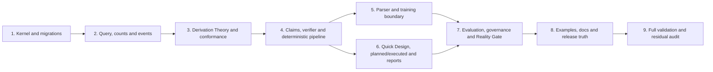

# N-Truth PRD v8.0 full repository migration — implementation plan

> Execute sequentially in the isolated worktree. For every behavioural task: write the failing
> test first, capture the expected failure, implement the smallest contract-complete change,
> run focused tests, then run the affected integration slice. Never train or touch external data.

**Goal:** migrate the current clean `origin/main` implementation to the PRD v8 engineering
contract while preserving correct mechanisms, making v7 compatibility explicit, and retaining
scientific/data blockers.

**Architecture:** raw/candidate inputs are verified into versioned facts in the Core Semantic
Kernel. A separately versioned Derivation Theory derives query-scoped claims. The Rulebook
implements theory and may emit adequacy/communication findings, but cannot define theory or
patch derived claims. Report resolution aggregates claims only under an explicit policy;
ambiguous PRD mappings fail closed.

**Base/worktree:** `fe089eff42c16e3fa55606be340c85df57c5442b` at
`/Users/massimilianociconte/Documents/N-truth/.worktrees/prd-v8-full-20260808` on
`codex/prd-v8-full-migration-20260808`.

## Dependency order



## Task 1 — Core Semantic Kernel, epistemic contracts and migration envelope

**Own:** `packages/ntruth/schemas/kernel.py`, `knowledge.py`, `claims.py` foundations,
`support.py`, `migrations/`, schema exports and focused schema/migration tests. Preserve v7
models as deprecated inputs.

1. Add red tests for six KnowledgeStates, reason/evidence obligations, scientific null/blank/
   empty rejection, orthogonal source/authority/evidence/support fields and v7 adapter output.
2. Implement frozen/versioned kernel identities, `KnowledgeValue`, evidence/source records,
   ConfirmationEvent/SensitivityRecord/RuleChallenge foundations and migration diagnostics.
3. Do not collapse conflicting SupportGrade vocabularies. Store vocabulary ID/token and emit
   `SCIENTIFIC_REVIEW_REQUIRED` for unreviewed conversions.
4. Generate/check JSON Schema and test round-trip, extra-field rejection and append-only event
   semantics.

## Task 2 — InferentialQuery, Canonical Count Registry and event graph

**Own:** query/count/causal/graph schemas and adapters; never make scientific resolver choices.

1. Red tests for multi-query scope, cohort collision, canonical count names, one-way
   `independent_n` alias, biological-source/EU independence and quantified bounds.
2. Add assignment/application/exposure/split/pool/observation events and event-referenced
   timing. Global timing is input-only deprecated data.
3. Make count value and decisive scope use explicit KnowledgeState and query/cohort/lifecycle/
   endpoint keys.
4. Add invariant/property tests for aggregation and silence-not-zero.

## Task 3 — Derivation Theory, Rulebook contract and conformance assets

**Own:** `packages/ntruth/derivation_theory/`, `theories/`, v8 rule schema/ruleset,
`packages/ntruth/conformance/`, reference-role registries and conformance tests.

1. Red tests: rule without theory clause, uncovered derived output, non-discriminating fixture,
   missing irrelevant-predicate rationale, reused gold/conformance role and open known gap.
2. Encode only PRD clauses A–G and mappings directly supported by the PRD. Each executable
   rule requires clause ID, required/irrelevant predicates with rationale, positive/negative/
   minimal-counterfactual fixtures, proof trace and known-gap behavior.
3. Unknown topology, aggregation policy, support mapping or scoring stays
   `SCIENTIFIC_REVIEW_REQUIRED`; do not copy unreviewed behavior from the old migration branch.
4. Pin theory/rules/profile/reference versions and checksums.

## Task 4 — Claim derivation, progressive verifier and pipeline cutover

**Own:** deterministic derivation/verifier, `DerivedClaim(Set)`, adequacy, coverage, report
resolution policy interface, graph equality exact mode, pipeline and correction/re-derivation.

1. Red regressions for source-independence proxy removal, interference not auto-changing EU,
   two claims/different states, NON_EXHAUSTIVE coverage and forbidden direct claim patch.
2. Derive assignment/EU/count/source/interference/analytical/inference-scope claims from verified
   facts and named theory clauses with dependency/proof traces.
3. Keep `DesignAdequacyFinding` independent. Implement exact identifier-invariant graph
   equality; leave partial scientific scoring blocked.
4. Aggregate report state only through a versioned policy. Ambiguous mixed states produce a
   review-required outcome, not invented precedence.
5. Cut the main pipeline and corrections over to facts→theory→claims→rule findings and ensure
   RuleChallenge triggers reviewed theory/rule change plus re-derivation.

## Task 5 — Candidate-only parser and protected training/evaluation splits

**Own:** active parser contract, MVT-A stage/verifier integration, training target/metrics,
record/manifest/export/runtime eligibility and backward adapters.

1. Flip legacy tests red: direct determinability/n/EU/adequacy fields are rejected recursively;
   TEST and EXTERNAL_CHALLENGE with training eligibility fail at every boundary.
2. Make the isolated candidate-stage contract canonical; add typed partial-success taxonomy and
   syntax-only normalization.
3. Introduce candidate-only `GoldParserTarget` and separate training/evaluation/release
   eligibility. Preserve lineage/checksum/family splitting.
4. Ensure no training entrypoint can proceed unless Reality Gate v8 authorizes it; tests use
   fake gates only and never start training.

## Task 6 — Quick Design, plan/execution reconciliation and neutral ReportBundle

**Own:** Quick Design/service/export, planned/executed contracts, ReportBundle/schema/renderers,
CLI/API and desktop presentation.

1. Red tests for event timing, `planned_unit_count`, immutable execution deviations and same
   planned design with different executed reality.
2. Emit query-scoped claims/counts/coverage and independent adequacy from Quick Design and
   reconstruction.
3. Add neutral ReportBundle JSON/YAML/HTML/UI sections for sources, candidates, confirmations,
   claims, proof, support/sensitivity, adequacy, scenario/profile coverage and limitations.
4. Remove/deprecate positive green determinability and all analysis-strategy suggestions.
   Expose `StrategyModuleStatus.HANDOFF_ONLY` system-wide.
5. Add JSON/HTML/CLI/UI snapshots where `DETERMINATE` coexists with inadequate design and
   non-exhaustive scenarios without approval language/color.

## Task 7 — Evaluation, contamination, governance and Reality Gate v8

**Own:** evaluation contracts/harness, contamination attestation/access ledger, decision rights,
readiness/blocker registry and Reality Gate.

1. Red tests for report-level scoring fields, blind residual role separation, cluster-aware
   denominators/CI interface, challenge UNKNOWN blockers and each missing Gate predicate.
2. Implement deterministic evaluation schemas and small frozen conformance fixtures only; do
   not fabricate benchmark results, gold, thresholds or real data.
3. Add ContaminationAttestation, custodian/access separation, backbone exposure uncertainty and
   permitted-claim policy. Appendix AG source remains expected-negative until review.
4. Implement all v8 Reality Gate predicates, six readiness dimensions and GO/REVISE/LIMIT/STOP
   decision records. Existing HOLD remains effective.
5. Add repository-wide NO_CORPUS/privacy/secret/large-file scans without inspecting or mutating
   external datasets.

## Task 8 — PRD examples, architecture map, governance and documentation truth

**Own:** conformance fixtures, machine-readable current→target map, GOVERNANCE/contribution/
release docs, README/status/CHANGELOG corrections, CI wiring and migration/changelog notes.

1. Add verbatim source examples as positive or expected-negative fixtures. Record exact
   diagnostics for internal PRD contradictions; never silently edit them into passing examples.
2. Add reviewed canonical examples only where the normative mapping is unambiguous.
3. Create current→target YAML containing current/target/status/API/owner/ADR/test/evidence for
   each component and validate every referenced path.
4. Repair only current documentation claims. Do not rewrite historical audited artifacts;
   label historical/non-normative records clearly.
5. Add link/path/schema/example/conformance gates to CI and v8 contribution templates.

## Task 9 — Full validation, independent review and clean-checkout proof

1. Run ruff, formatting, mypy, full unit/integration/E2E/schema/migration/conformance/open-world/
   count/coverage/Reality Gate suites, desktop tests/build and distribution checks.
2. Run NO_CORPUS, privacy, secret and large-file scans; verify no external data/model artifacts
   were created or changed.
3. Build sdist/wheel, install into a fresh temporary environment and run CLI/schema smoke tests.
4. Run documentation/link/current-target truth from a fresh clean worktree of the final commit.
5. Conduct an independent code review against this plan and the requirement matrix. Fix all
   P0/P1 findings with the same test-first discipline.
6. Update the matrix with final status and evidence. Any remaining partial/missing item must
   cite a blocker/register ID; never infer conformity from green tests alone.

## Required validation commands

The exact project scripts may be expanded as implementation adds focused commands, but the
minimum final gate is:

```text
uv run ruff check .
uv run ruff format --check .
uv run mypy packages
uv run pytest --disable-warnings
pnpm test -- --run
pnpm build
```

Plus explicit focused suites for schema/migration, PRD examples, Theory↔Rule closure,
open-world semantics, counts, determinability/adequacy separation, ScenarioCoverage,
Reality Gate, E2E/residual/cluster evaluation, packaging and clean-checkout documentation.
